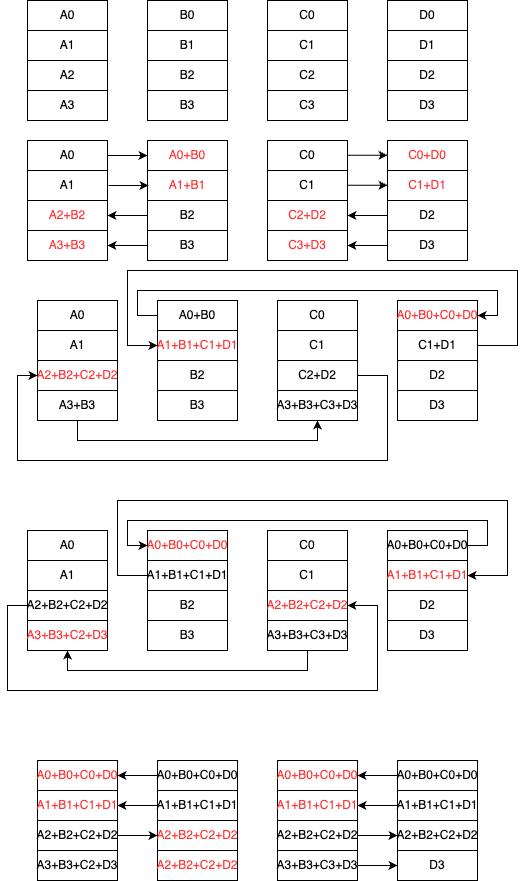
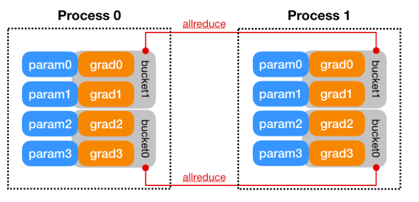

为什么我们需要更高效的 DDP 模式，以及 DP 架构的局限性。

{/* truncate */}

## DDP 是个啥

### python GIL

python 是通过引用计数做内存管理。[GIL机制](https://realpython.com/python-gil/) 是所有线程共享一把锁。对于 multi-thread process，锁竞争大，效率不高。

### 古早DP

```python
model = torch.nn.DataParallel(model)
```

单进程多线程（受GIL限制），Parameter Server架构(PS主从模式)：server节点*scatter*参数到worker节点，*gather*接受所有worker节点计算的梯度，求和(all reduce)之后再scatter到worker节点。


DP中的一些通信语义是通过两卡间p2p通信实现的。

```cpp
std::vector<at::Tensor> scatter (
  const at::Tensor& tensor,
  at::IntArrayRef devices,
  const c10::optional<std::vector<int64_t>>& chunk_sizes,
  int64_t dim,
  const c10::optional<std::vector<c10::optional<at::cuda::CUDAStream>>>& streams) {
  TORCH_CHECK(!devices.empty() , "Expected at least one device to scatter to");
  if (chunk_sizes.has_value()) {
    TORCH_CHECK(
      chunk_sizes->size() == devices.size(),
      "Expected devices and chunk_sizes to be of same length, but got "
      "len(devices) = " ,
      devices.size() ,
      " and len(chunk_sizes) = " ,
      chunk_sizes->size());
  }
  dim = at:: maybe_wrap_dim (dim, tensor) ;
  // NOLINTNEXTLINE(cppcoreguidelines-init-variables)
  std::vector<at::Tensor> chunks = chunk_sizes
    ? tensor.split_with_sizes(/*split_sizes=*/*chunk_sizes, /*dim=*/dim)
    : tensor.chunk(/*chunks=*/devices.size() , /*dim=*/dim);
  at::cuda::OptionalCUDAStreamGuard cuda_guard;
```

在cuda copy 算子实现中：
1. 先检测两卡之间是否可以点对点通信
2. 可以点对点通信之后，再做D2D拷贝：cudamemcpy/cudamemcpyAsync


*Notice*:
可能没有办法在DP 通信算子里使用collective communicatore。
XMLIR栈：可能可以借助cpu：xpu 0->cpu->xpu1类似cuda copy算子。

### InitProcessGroup
其实就是对Process group设置属性：`https://pytorch.org/docs/stable/distributed.html`
* world_size: 进程数
* rank: 进程序号, [0, world_size-1]
* local_rank: 进程内的卡id，torch.distributed.launch 时候指定的。
* MASTER_ADDR：rank0(master) 地址
* MASTER_PORT：rank0(master) 端口号
* init_method：URL，寻找peers。三种模式：TCP， FILE，ENV(master addr + master port 拼)
  
单机2卡: `world_size: 2;  rank: [0, 1];  local_rank: [0, 1]`
2机8卡: `world_size: 16, rank: [0, 1, ...., 15];   node 0: local_rank: [0, 1, ..7],  node1 : local_rank[0, 1, ... 7]`

### DDP

1. torch DDP 采用是多进程，每个进程一张卡，绕过GIL限制。
2. ring reduce 算法梯度更新
3. model parallel，data parallel

```python
## ddp example
dist.init_process_group("xccl", rank=rank, world_size=world_size
# create model and move it to GPU with id rank
model = ToyModel().to(rank)
ddp_model = DDP(model, device_ids=[rank])
```

## DDP 原理+源码实现

### 数据一致性

参数平均：优化器执行之后所有模型的参数求平均。backward计算和通信无法并行；梯度下降方向不一样；数学不等价。
梯度平均：所有模型梯度求平均，之后每个进程更新。计算和通信可以并行，数学等价

### 总结构

DDP 每个进程拥有模型副本，优化器。所有进程的模型副本初始化状态相同，优化器每次step的梯度相同。


数据并行以nn.module为基础:

```python
ddp_model = DDP(model, device_ids=[rank])
```

分布式模型替代本地模型，拦截forward()调用相应的分布式forward操作。反向时依靠autograd engine 调用backwad hook（参数中检索梯度张量）触发gradient reduce (代码实现在reducer.cpp)。

#### All reduce


1. Ring all reduce 算法


2. Double Binary Tree all reduce 算法



### Gradient Bucketing


collective communicator在large tensor上效率更高。DDP使用分桶策略达到较高的通信吞吐：将小tensors 聚合在一起然后做all reduce。分桶策略如下：
model.parameter*倒序* 插入bucket中，当一个bucket的参数的梯度都已经更新，执行all reduce向另外process对应bucket传递梯度。DDP为每一个梯度累加器注册一个自动求导钩子，并在相应的累加器更新梯度后激活。当一个bucket内的所有钩子都被激活时，最后一个被激活的钩子会触发allreduce操作，以此实现异步all reduce。如果参数桶相对小，DDP可以在反向传播的同时启动allreduce操作，使通信与计算重叠。（如下图所示）



*Notice* ：
1. PyTorch 在每次前向传递中动态构建自动梯度图，不同的进程可能不会就梯度就绪顺序达成一致：图(a) 中process 1 四个梯度是按顺序计算，process 2的g2 梯度在g3和g4之后计算。桶中梯度更新之后触发all reduce，会导致两个进程allreduce错位。*因此，所有进程都使用相同的分组顺序，并且i号桶启动allreduce之前i+1号桶无法启动。如果 bucket 0 是最后一个准备就绪的，则通信无法与计算重叠* 。
2. 基于上述方案，bucket i 一定是先于bucket i+1 触发allreduce。那么DDP为了加速反向通信效率，*DDP在构建bucket时候将参数倒序的插入到bucket中，因为反向是正向的逆序。这样可以满足绝大多数的场景需求，工程开销小。* 
3. 一次迭代可能训练一个子图，且训练过程中子图会随着迭代发生变化，可能某些梯度在某些迭代中被忽略。分桶发生在DDP初始化，被跳过的梯度可能会导致其所在桶一直无法触发allredue，从而导致backward hang住：图(b)中process1 中的g3在某次迭代中被跳过，因此g3&4所在bucket无法ready。*为了解决此问题，DDP遍历从前向传播的输出张量得到的自动求导图来找到所有的参与参数，然后将未参与的参数直接标记为就绪* 。


### Gradient Accumulation

在局部执行n次训练迭代之后再执行一次allreduce可以在很大程度上减少梯度同步。这同时有助于训练一个超大的，无法一次性放入显存的input batch，可以将input batch分成some small batch，然后在这些small batch上进行forward 和 backward，再当整个batch训练完成之后发起梯度同步。PyTorch使用ddp.no_sync()以作为累加的标识，以*避免与上述说到的"DDP遍历从前向传播的输出张量得到的自动求导图来找到所有的参与参数，然后将未参与的参数直接标记为就绪."* 解决方法冲突。

```python
ddp = torch.nn.parallel.DistributedDataParallel(model, pg)
with ddp.no_sync():
    for input in inputs:
        ddp(input).backward()  # no synchronization, accumulate grads
ddp(another_input).backward()  # synchronize grads             
```

### DDP源码粗分析


#### 模型广播
* 将模型parameter，buffer广播到各节点
* 初始化Bucket
* 将模型的参数倒序分配到各个桶中
* 创建管理器reducer，给每个parameter注册梯度平均的hook。
```python
def __init__(
        self,
        module,
        device_ids=None,
        output_device=None,
        dim=0,
        broadcast_buffers=True,
        process_group=None,
        bucket_cap_mb=25, # 25MB
        find_unused_parameters=False,
        check_reduction=False,
        gradient_as_bucket_view=False,
        static_graph=False,
    ):

        super(DistributedDataParallel, self).__init__()
        Joinable.__init__(self)
        self.logger = None
        if not any((p.requires_grad for p in module.parameters())):
            self._log_and_throw(
                RuntimeError,
                "DistributedDataParallel is not needed when a module "
                "doesn't have any parameter that requires a gradient.",
            )

        if device_ids is not None and len(device_ids) > 1:
            self._log_and_throw(
                ValueError, "device_ids can only be None or contain a single element."
            )
        # 设置设备类型
        self.is_multi_device_module = len({p.device for p in module.parameters()}) > 1
        distinct_device_types = {p.device.type for p in module.parameters()}
        if len(distinct_device_types) != 1:
            self._log_and_throw(
                ValueError,
                "DistributedDataParallel's input module must be on "
                "the same type of devices, but input module parameters locate in {}.".format(
                    distinct_device_types
                ),
            )

        self.device_type = list(distinct_device_types)[0]
        
        # 设置设备IDs
        if (
            device_ids is None
            or len(device_ids) == 0  # For backward compatibility.
            or self.device_type == "cpu"
            or self.is_multi_device_module
        ):
            if device_ids or output_device:
                self._log_and_throw(
                    ValueError,
                    "DistributedDataParallel device_ids and output_device arguments "
                    "only work with single-device/multiple-device GPU modules or CPU modules, "
                    "but got device_ids {}, output_device {}, and module parameters {}.".format(
                        device_ids,
                        output_device,
                        {p.device for p in module.parameters()},
                    ),
                )

            self.device_ids = None
            self.output_device = None
        else:
            self.device_ids = [_get_device_index(x, True) for x in device_ids]

            if output_device is None:
                output_device = device_ids[0]

            self.output_device = _get_device_index(output_device, True)  
        # get process group   
        if process_group is None:
            self.process_group = _get_default_group()
        else:
            self.process_group = process_group
        # 配置各种成员变量 
        self.static_graph = False
        self.dim = dim
        self.module = module
        self.device = list(self.module.parameters())[0].device
        self.broadcast_buffers = broadcast_buffers
        self.find_unused_parameters = find_unused_parameters
        self.require_backward_grad_sync = True
        self.require_forward_param_sync = True
        self.gradient_as_bucket_view = gradient_as_bucket_view
        if hasattr(module, "_ddp_params_and_buffers_to_ignore"):
            self.parameters_to_ignore = module._ddp_params_and_buffers_to_ignore
        else:
            self.parameters_to_ignore = []

        self._use_replicated_tensor_module = _ddp_with_replicated_tensor_enabled()
        self._build_replicated_tensor_module()

        if check_reduction:
            # This argument is no longer used since the reducer
            # will ensure reduction completes even if some parameters
            # do not receive gradients.
            warnings.warn(
                "The `check_reduction` argument in `DistributedDataParallel` "
                "module is deprecated. Please avoid using it."
            )

        # Check that a module does not have Uninitialized parameters
        # 检查 parameters, 是否有未被初始化的
        for param in module.parameters():
            if isinstance(param, torch.nn.parameter.UninitializedParameter):
                self._log_and_throw(
                    RuntimeError,
                    "Modules with uninitialized parameters can't be used with `DistributedDataParallel`. "
                    "Run a dummy forward pass to correctly initialize the modules",
                )
        
             
        # used for intra-node param sync and inter-node sync as well
        # 设置broacast buffer size大小。在broadcast参数时，也用到了bucket思想（此bucket 非上述bucket）
        self.broadcast_bucket_size = int(250 * 1024 * 1024)
           
        # reduction bucket size
        self.bucket_bytes_cap = int(bucket_cap_mb * 1024 * 1024)
        # Whether to perform input tensor CPU to GPU copies on a side-stream
        self.use_side_stream_for_tensor_copies = (
            os.environ.get("PYTORCH_DDP_USE_SIDE_STREAM", "1") == "1"
        )
        
        # 先构建参数列表（remove modules 共享参数，找到需要求导参数，sparse梯度单独一个list）
        parameters, expect_sparse_gradient = self._build_params_for_reducer()
        # 检查跨进程时，parameter shape和stride是否一致
        _verify_param_shape_across_processes(self.process_group, parameters)
        # Sync params and buffers. Ensures all DDP models start off at the same value.
        # 将 rank 0 的state_dict()（modules weight and bias） 广播到其他worker，以保证所有worker的模型初始状态相同；
        # 这里会调到process_group的broadcast_coalesced: broadcast 批量tensor（bucket）
        _sync_module_states(
            module=self.module,
            process_group=self.process_group,
            broadcast_bucket_size=self.broadcast_bucket_size,
            src=0,
            params_and_buffers_to_ignore=self.parameters_to_ignore,
        )
        # In debug mode, build a mapping of parameter index -> parameter.
        param_to_name_mapping = self._build_debug_param_to_name_mapping(parameters)
  
        # 分桶策略：
        # 1. 对参数进行分桶，尽可能按照前向传播的逆序把参数分配平均分配入桶
        # 2. 重置分桶状态
        # 3. 生成一个Reducer，注册 autograd_hook，其用来在反向传播时候进行梯度同步
        # 4. 给SyncBatchNorm Layer传递 DDP handle （没懂干啥的）
        self._ddp_init_helper(
            parameters, expect_sparse_gradient, param_to_name_mapping, static_graph
        )
        self._has_rebuilt_buckets = False

        if static_graph:
            self._set_static_graph()
```

*Parameter-to-Bucket Mapping* ：
在每次向后传播中，将所有参数梯度中的张量复制到bucket中，并在allreduce之后将平均梯度复制回bucket中。为了加速复制操作，同一bucket中的所有参数都位于同一设备上。参数梯度到桶的映射是在构建时根据桶大小限制和参数大小确定的，通过设置bucket_cap_mb来配置桶的大小。

*Reducer* 

```cpp
  {
    const auto variable_count = params_.size();
    grad_accumulators_.resize(variable_count);
    // 遍历张量
    for (const auto variable_index : c10::irange(variable_count)) {
      auto& variable = params_[variable_index];
      // 得到Variable::AutogradMeta的grad_accumulator_，即用于累加叶子 Variable 的梯度累加器
      auto grad_accumulator = torch::autograd::impl::grad_accumulator(variable);
      
      // Hook to execute after the gradient accumulator has executed.
      // 累加器添加hook,这个 hook 挂在 autograd graph 之上，在 backward 时负责梯度同步。
      // grad_accumulator 执行完后，autograd_hook 就会运行
      hooks_.emplace_back(
          grad_accumulator->add_post_hook(
              torch::make_unique<torch::autograd::utils::LambdaPostHook>(
                  [=](const torch::autograd::variable_list& outputs,
                      const torch::autograd::variable_list& /* unused */) {
                    this->autograd_hook(variable_index); // autograd_hook中会判断张量是否ready，如果bucket中tensor全都ready,则触发all reduce
                    return outputs;
                  })),
          grad_accumulator);

      // Map raw function pointer to parameter index.
      // This is used later on when the autograd graph is traversed
      // to check for parameters for which no gradient is computed, if
      // find_unused_parameters=True.
      // Note that the mapping of gradient accumulator to variable should be
      // one to one as we deduplicate shared parameters before constructing
      // Reducer.
      if (find_unused_parameters_) {
        gradAccToVariableMap_[grad_accumulator.get()] = variable_index;
      }

      numGradHooksTriggeredMap_[variable_index] = 0;

      // The gradient accumulator is stored as weak_ptr in the autograd
      // metadata of the variable, so we have to keep it alive here for
      // the raw pointer to be valid.
      REDUCER_CHECK(
          grad_accumulators_[variable_index] == nullptr,
          logger_,
          c10::str(
              "Reducer tried to register duplicate grad accumulator for variable ",
              variable_index));

      grad_accumulators_[variable_index] =
          std::move(grad_accumulator);
    }
  }

  // Initialize backward stats vector.
  {
    const auto variable_count = params_.size();
    backward_stats_.resize(variable_count);
  }

  // See Note [Skip allreducing local_used_map_dev]
  if (find_unused_parameters_) {
    initialize_local_used_map();
  }
}
```

Autograd Hook是DDP在后向传播中的切入点。在构建过程中，DDP遍历模型中的所有参数，在每个参数上找到梯度累加器，并为每个梯度累加器安装相同的hook函数。梯度累加器将在相应的梯度准备就绪时，会触发hooks，DDP将计算出整个bucket何时全部就绪，这样可以启动`allreduce`操作。在当前的实现中，每个bucket都保留一个挂起的梯度计数。每个hook函数都会递减计数，当计数为零时，DDP会将一个bucket标记为ready。在下一次向前传播中，DDP会为每个bucket补齐待定的累积计数。


### Foward
DDP的 forwad 函数是model forwad 函数的简单包装器。
* 每个进程读去自己的训练数据，DistributedSampler确保每个进程读到的数据不同。
* DDP 获取输入并将其传递给本地模型。
* 模型进行前向计算，结果设置为 out。
* 如果find_unused_parameters设置为True。DDP 会分析本地模型的输出，从 out 开始遍历计算图，把未使用参数标示为 ready，因为每次计算图都会改变，所以每次都要遍历。
* 在后向传播期间，Reducer会allreduce所有bucket，在此过程中，Reducer会等待未准备好的参数。
* 遍历 autograd 图会引入额外的开销，因此应用程序仅在必要时才设置 find_unused_parameters为True 。
```python
def forward(self, *inputs, **kwargs):
        with torch.autograd.profiler.record_function("DistributedDataParallel.forward"):
            # 则调用 reducer 为forward做准备
            if torch.is_grad_enabled() and self.require_backward_grad_sync:
                self.logger.set_runtime_stats_and_log()
                self.num_iterations += 1
                self.reducer.prepare_for_forward()

            # Notify the join context that this process has not joined, if
            # needed
            work = Join.notify_join_context(self)
            if work:
                self.reducer._set_forward_pass_work_handle(
                    work, self._divide_by_initial_world_size
                )

            #在前向传播之前使用 _rebuild_buckets 来重置桶.
            if torch.is_grad_enabled() and self.reducer._rebuild_buckets():
                logger.info("Reducer buckets have been rebuilt in this iteration.")
                self._has_rebuilt_buckets = True

            # sync params according to location (before/after forward) user
            # specified as part of hook, if hook was specified.
            buffer_hook_registered = hasattr(self, 'buffer_hook')
            if self._check_sync_bufs_pre_fwd():
                self._sync_buffers()

            if self._join_config.enable:
                # Notify joined ranks whether they should sync in backwards pass or not.
                self._check_global_requires_backward_grad_sync(is_joined_rank=False)
            
            # 进行前向传播 
            output = self._run_ddp_forward(*inputs, **kwargs)

            # 如果需要同步前向传播参数，则进行同步  
            if self._check_sync_bufs_post_fwd():
                self._sync_buffers()

            # 如果需要同步后向传播梯度，则调用prepare_for_backward
            if torch.is_grad_enabled() and self.require_backward_grad_sync:
                self.require_forward_param_sync = True
                if self.find_unused_parameters and not self.static_graph:
                    # Do not need to populate this for static graph.
                    # 当DDP参数 find_unused_parameter 为 true 时
                    # 其会在 forward 结束时，启动一个回溯，标记出所有没被用到的 parameter，
                    # 提前把这些设定为 ready，这样 backward 就可以在一个 subgraph 进行。
                    # prepare_for_backward: 重置，查找未使用的参数。
                    self.reducer.prepare_for_backward(list(_find_tensors(output)))
                else:
                    self.reducer.prepare_for_backward([])
            else:
                self.require_forward_param_sync = False

        # TODO: DDPSink is currently enabled for unused parameter detection and
        # static graph training for first iteration.
        if (self.find_unused_parameters and not self.static_graph) or (
            self.static_graph and self.num_iterations == 1
        ):
            state_dict = {
                'static_graph': self.static_graph,
                'num_iterations': self.num_iterations,
            }

            output_tensor_list, treespec, output_is_rref = _tree_flatten_with_rref(
                output
            )
            output_placeholders = [None for _ in range(len(output_tensor_list))]
            # Do not touch tensors that have no grad_fn, which can cause issues
            # such as https://github.com/pytorch/pytorch/issues/60733
            for i, output in enumerate(output_tensor_list):
                if torch.is_tensor(output) and output.grad_fn is None:
                    output_placeholders[i] = output

            # When find_unused_parameters=True, makes tensors which require grad
            # run through the DDPSink backward pass. When not all outputs are
            # used in loss, this makes those corresponding tensors receive
            # undefined gradient which the reducer then handles to ensure
            # param.grad field is not touched and we don't error out.
            passthrough_tensor_list = _DDPSink.apply(
                self.reducer,
                state_dict,
                *output_tensor_list,
            )
            for i in range(len(output_placeholders)):
                if output_placeholders[i] is None:
                    output_placeholders[i] = passthrough_tensor_list[i]

            # Reconstruct output data structure.
            output = _tree_unflatten_with_rref(
                output_placeholders, treespec, output_is_rref
            )
        return output
```
### Backward


* backward()在 loss 上直接调用，这是autograd 的工作，是 DDP 无法控制的，DDP采用了Hook来达到目的。
* DDP 在构造时注册了一个 autograd hooks。
* Autograd 引擎进行梯度计算。
* 当一个梯度准备好时，它在该梯度累加器上的相应 DDP 钩子将被触发。
* 在 autograd_hook 之中进行allreduce。当一个bucket中的梯度都准备好时，会在该bucket上Reducer启动异步allreduce以计算所有进程的梯度平均值。如果所有bucket都ready，则等待所有allreduce完成。完成后，将平均梯度写入param.grad所有参数的字段。所以在向后传播完成之后，跨不同DDP进程的对应的相同参数上的 grad 字段应该是相等的。

### Join
代码里面会有一些join的地方。join主要是解决work负载不均衡的问题。collective communicator 通信是要每个rank都参与的。如果rank之间负载不均衡，会导致通信hang住。join的作用是为提前结束的rank构建dummy all reduce。

https://pytorch.org/tutorials/advanced/generic_join.html

https://www.cnblogs.com/rossiXYZ/p/15584560.html#52-%E4%BD%BF%E7%94%A8


## QA问题汇总
### bucket 内存是不是连续/all reduce 结束后为啥需要拷贝
```c++
struct Bucket {
    // Gradients of the bucket flattened into a 1-dimensional tensor
    at::Tensor gradients;

    // Views into the `gradients` tensor for each individual gradient
    // Each view is created with layout (size and stride) matching the
    // gradient's expected layout (see the "Gradient Layout Contract" in
    // torch/csrc/autograd/functions/accumulate_grad.h).
    // `bucket_views_in[i].copy_(grad)` and `grad.copy_(bucket_views_out[i])`
    // provide convenient ways to copy gradient data in/out of `gradients`,
    // respectively.
    // We keep both `bucket_views_in` and `bucket_views_out` because
    // registering a DDP communication hook may re-initialize
    // `bucket_views_out` with the value of the hook's `future_work` but we
    // still need separate views into the bucket's original flattened gradient
    // to copy in gradient data.
    // 提供了从输入角度查看gradients梯度的方法
    std::vector<at::Tensor> bucket_views_in;
    // 提供了从输出角度查看gradients梯度的方法
    std::vector<at::Tensor> bucket_views_out;

    // Variables whose gradients are held in this bucket
    // We use refcounted tensors here so that we can easily unflatten the
    // bucket's flattened `gradients` tensor into the participating variables
    // after reduction has completed.
    std::vector<at::Tensor> variables;

    // Per-variable offset/length into the flattened `gradients` tensor and
    // the corresponding `GradBucket` instance for communication hooks
    std::vector<size_t> offsets;
    std::vector<size_t> lengths;

    // Per-variable sizes slicing into the bucket's `gradients` tensor
    std::vector<c10::IntArrayRef> sizes_vec;

    // Number of gradients left to be computed before the bucket is ready to
    // be reduced
    size_t pending;

    // Global indices of participating variables in the bucket
    std::vector<size_t> variable_indices;

    // Future work handle for DDP communication hook
    // If no hook is registered, a temporary vanilla allreduce hook is used.
    c10::intrusive_ptr<at::ivalue::Future> future_work;

    // If this bucket should expect a single sparse gradient
    // If `true`, then this implies that `bucket.variables.size() == 1`.
    bool expect_sparse_gradient = false;

    // TODO(@pietern)
    // Memory copies from gradient tensors into the bucket are potentially
    // done on different CUDA streams. We record an event for every copy
    // so that we can synchronize with them prior to kicking off the reduction.
    // std::vector<at::cuda::CUDAEvent> events;

  };
```
1. gradients 是一个连续buffer，reducer将bucket中的所有gradients 平铺开放到一个一维Tensor中。
在`void Reducer::initialize_buckets(std::vector<std::vector<size_t>> bucket_indices)`函数中：


2. bucket_views_in/bucket_views_out 干啥的：在 PyTorch 之中，视图是指创建一个方便查看的东西，视图与原数据共享内存，它只是将原有的数据进行整理，直接显示其中部分内容或者进行重排序后再显示出来。每个 view 都将按照如下布局（sizes + strides）创建，这个布局与grad的预期布局相匹配。bucket_views_in 和 bucket_views_out 提供了视图（views），该视图可以操作gradients 中的每个张量梯度。用户把这两个变量作为入口点用来操作gradients：移入移除parameter tensor。
```c++
// /home/pytorch/torch/csrc/distributed/c10d/reducer.cpp
// (see Note:  "Gradient Layout Contract" in initialize_buckets).
void Reducer::initialize_bucket_views(Reducer::Bucket& bucket) {
  const auto& gradients = bucket.gradients;
  for (const auto i : c10::irange(bucket.variables.size())) {
    auto& v = bucket.variables[i];
    const auto offset = bucket.offsets[i];
    const auto length = bucket.lengths[i];
    if (v.is_non_overlapping_and_dense()) {
      // If the param's memory is dense, match its layout, anticipating
      // the autograd engine (AccumulateGrad) will also create gradients
      // matching its layout.
      bucket.bucket_views_in.push_back(
          gradients.as_strided(v.sizes(), v.strides(), offset));
    } else {
      // Fall back to a C-style contiguous view, again anticipating
      // AccumulateGrad will do the same when stashing grads for non-dense
      // params.
      bucket.bucket_views_in.push_back(
          gradients.narrow(0, offset, length).view(v.sizes()));
    }
    // By default `bucket_views_out` and `bucket_views_in` are
    // essentially the same thing.
    bucket.bucket_views_out = bucket.bucket_views_in;

    // If gradient_as_bucket_view_ is set as true, then there are two cases to
    // handle: initialize_bucket_views could be called inside initialize_buckets
    // when rebuild_buckets, if grad has already been defined/calculated in
    // previous iteration, old grad needs to be copied into new bucket_view and
    // let grad point to the new bucket_view, initialize_bucket_views could also
    // be called inside initialize_buckets during construction. Grads are not
    // defined during construction time, in this case, do not let grad point to
    // bucket_view, because grads should be kept as being undefined for globally
    // unused parameters.
    if (gradient_as_bucket_view_) {
      auto& bucket_view = bucket.bucket_views_in.back();
      runGradCallbackForVariable(v, [&](auto& grad) {
        if (grad.defined() && !grad.is_alias_of(bucket_view)) {
          bucket_view.copy_(grad);
          // 梯度被修改，要更新
          grad = bucket_view;
          // The grad is modefied and needs to be written back.
          return true;
        }
        // The grad is not modified and does not need to be written back.
        return false;
      });
    }
  }
}

```
### barrier 和join 区别
barrier 目的：设置一个阻塞栅栏，让此进程处于等待状态，等待所有进程到达栅栏处（包括主进程的数据都处理完）。
join目的：rank之间数据不均衡的问题。比如rank0只有一个数据，rank1是两个数据，rank0结束之后，rank1还有一个数据没有通信，此时就会hang住/出错。join做的事情就是做一个dummy all reduce 和rank1接着做通信。

### 一张卡多个process group通信并行


Round-Robin 分发collective communicate 到不同的process group。 每个process group都要nccl_init_rank创建ncclcontext （大于等于一个），ncclcontext中维护一个queue，该queue有序存放了通信task（传输的buffer等等），这里可以理解为串行缓冲队列。咨询了大佬，如果要在一个process group内实现多个collective communication的并行，可以创建多个nccl context来做异步。如果通信可以打满带宽。可能多个collective communication 并行的意义不是很大。


