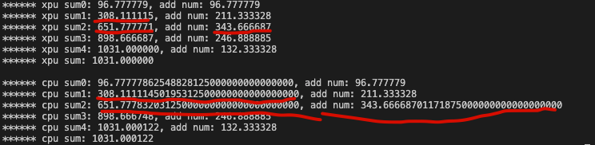
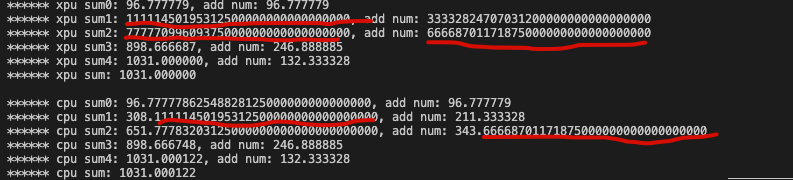
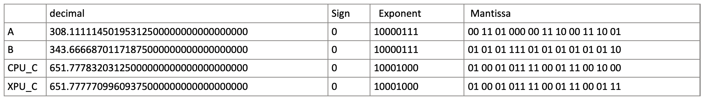

为啥会来探索浮点数运算呢？是因为我在调试新人练习题图像加权平滑的时候，遇到了GPU和CPU的精度误差大于`1e-4`，这让我非常不理解.... 然后我就陷在了奇怪问题中，好在推理出来了（有理有据）。

{/* truncate */}

## 问题重现
```cpp
// GPU example test
__global__ void GPU_example(float *data) {
__local__ float temp_data[5];
__local__ float weight[5] = {
        1.0f / 9,
        2.0f / 9,
        3.0f / 9,
        2.0f / 9,
        1.0f / 9,
};
GM2LM(data, temp_data, 5 * sizeof(float));
float sum = weight[0] * temp_data[0];
printf("****** GPU sum0: %f, add num: %f\n", sum, weight[0] * temp_data[0]);
sum += weight[1] * temp_data[1];
printf("****** GPU sum1: %f, add num: %f\n", sum, weight[1] * temp_data[1]);
sum += weight[2] * temp_data[2];
printf("****** GPU sum2: %f, add num: %f\n", sum, weight[2] * temp_data[2]);
sum += weight[3] * temp_data[3];
printf("****** GPU sum3: %f, add num: %f\n", sum, weight[3] * temp_data[3]);
sum += weight[4] * temp_data[4];
printf("****** GPU sum4: %f, add num: %f\n", sum, weight[4] * temp_data[4]);
printf("****** GPU sum: %f\n\n", sum);

}

// cpu example test
void cpu_example(float *data) {
float weight[5] = {
        1.0f / 9,
        2.0f / 9,
        3.0f / 9,
        2.0f / 9,
        1.0f / 9,
};

float sum = weight[0] * data[0];
printf("****** cpu sum0: %2.32f, add num: %f\n", sum, weight[0] * data[0]);
sum += weight[1] * data[1];
printf("****** cpu sum1: %2.32f, add num: %f\n", sum, weight[1] * data[1]);
sum += weight[2] * data[2];
printf("****** cpu sum2: %2.32f, add num: %2.32f\n", sum, weight[2] * data[2]);
sum += weight[3] * data[3];
printf("****** cpu sum3: %f, add num: %f\n", sum, weight[3] * data[3]);
sum += weight[4] * data[4];
printf("****** cpu sum4: %f, add num: %f\n", sum, weight[4] * data[4]);
printf("****** cpu sum: %f\n", sum);
}
```
build and run 之后，看一下结果～：



图片中标红的部分表示最初引入误差的地方，那么问题可以简化成**“308.11115“ 和 “343.666687“ 相加结果，GPU和CPU误差大于1e-4**。

## 分析问题

**“308.11115“ 和 “343.666687“ 相加结果，GPU和CPU误差大于1e-4**。

为了方便表达，使用“A“ 表示 “308.11115“ ，使用“B“ 表示 “343.666687“， GPU计算结果使用“GPU_C" ,  CPU 计算结果使用“CPU_C“。

1. 排除两个输入小数点精度的误差 （这里有个小问题，printf 打印小数点后面几位数,  like %m.nf, 会吞点整数位）



1. 红线标注地方发现：小数点后32位GPU和CPU是一样的。所以可以确定误差是由加法运算引入。
2. 加法运算引入误差，有可能是非规格化导致，也有可能是规格化运算溢出导致，也有可能是舍入导致。基于此，那咱只能硬核笔推一把了。。。探索一下具体原因，还能带可以回顾一下浮点数加减计算方式。

## 浮点数加减运算

为了方便验证，我们先将两个十进制浮点数输入和GPU，CPU计算结果转化成二进制浮点数。
（推荐IEEE745转换神器：[https://www.h-schmidt.net/FloatConverter/IEEE754.html](https://www.h-schmidt.net/FloatConverter/IEEE754.html) ）



计算 A+B：

$$
\begin{array}{ccc}
&0&10000111&00110100000111000111001\\
+&0&10000111&01010111101010101010110\\
\hline
=&?
\end{array}
$$

1. 对阶
A 的阶码"10000111" 和 B的阶码"10000111" 是一样的，所以不需要对阶处理。
2. 尾数相加和规格化处理
A的尾数"00110100000111000111001" 和 B的尾数“01010111101010101010110“相加：

$$
\begin{array}{ccc}
&00110100000111000111001\\
+&01010111101010101010110\\
\hline
=& 10001011110001110001111
\end{array}
$$

尾数M溢出（看符号位，从0变为1，因此溢出），需要右规格化处理：尾数右移一位且阶码加1：

（1）尾数右移：`10001011110001110001111    ->    01000101111000111000111 ***(1)***`

（2）阶码加一：`10000111 +1     ->   10001000`

和上面图片中651.xxx 的阶码部分对比，是不是一模一样！！！ 说明咱的思路是对的哈哈哈

**Notice: 请一定记住这里被我们右移舍弃掉的括号括起来的1，它将在后面发挥至关重要的作用。**

3. ***舍入***

```
现在 A+B 经过尾数溢出后的右规格化处理，变成了：
```

$$
\begin{array}{ccc}
&0&10000111&00110100000111000111001\\
+&0&10000111&01010111101010101010110\\
\hline
=&0&10001000&01000101111000111000111
\end{array}
$$

OK～～，华生发现盲点了么？现在的计算结果 “0 10001000 01000101111000111000111“ 和上图中 GPU_C 的二进制码一模一样啊！！！也就是GPU到这里，两个浮点数的加法运算已经结束了～～， 没有舍入，丢点就丢点精度呗，咱硬件的core那么多了，增加一个单元，再重新走一遍规格化，GPU可能觉得麻烦。

好的，那让咱接着看CPU，CPU老人家可不觉得麻烦，毕竟老人家通用且较真，他觉得右移使浮点数精度下降了，所以他要近可能补回来的，So，他的舍入原则是当移掉低位数的最高位为1时，他将这个1要再加回尾数，like this：

$$
\begin{array}{ccc}
&01000101111000111000111\\
+&00000000000000000000001\\
\hline
=&01000101111000111001000
\end{array}
$$

至此，把符号位，阶码，尾数拼在一起得到二进制码 “0 10001000 01000101111000111001000“，这不就是CPU_C的值嘛嘿嘿嘿。

## 总结
根据这个奇怪现象，俺们能得到的信息就是GPU在进行浮点数加减运算时处于某种原因摒弃了舍入机制，也能说的过去，因为上面的例子，CPU舍入之后，会比笔算十进制的值大一丢丢，而GPU没有舍入，值稍微小了一丢丢，都还能接受吧。毕竟跑网络都看相对误差。

“没用“的知识又增加了，完结散花。