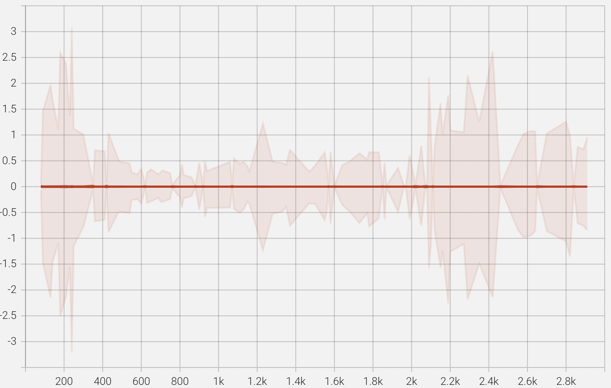

LOSS SCALE 研究


{/* truncate */}

## 了解loss scale

### DynamicGradScaler

初始化`initial_scale`为512. 目前llama 系列的为 `DynamiGradScaler`。


解读一下参数含义

1. `hysteresis`=2

连续`hysteresis`次出现NAN，减小loss scale. （PS: hysteresis 这个词用的很物理）。

2. `growth_interval`=1000

       Number of training iterations of no NaNs

3. `growth_factor` =2.0

如果在“`growth_interval`” 内没有发现NAN, 则Factor to grow loss scale。取值大于1。

```
self._scale = torch.max(self._scale * self.backoff_factor, self.min_scale)
```
4. `backoff_factor`=0.5,

       Factor to decrease loss, 取值是`(0,1]`之间

```
self._scale = torch.max(self._scale * self.backoff_factor, self.min_scale)
```
### Grad scale 和loss scale 更新
#### Grad scale
在backward计算梯度时，先将损失值乘以一个大的常数（即loss scale），


#### Grad unscale
optimizer.step的时候, graidents 除以scale.


#### loss scale 更新
optimizer.step的时候，gradient unscale 之后更新loss scale。


## 数值分析

### 总结
与反向梯度累加有关系。看起来

### 多卡数值分析
所以按照megatron 0.6 core 默认参数： 只要不出NAN。。loss scale 是每1000 iteration，增大一倍。

然后对应图上：1000 iter的时候init_loss_scale 从64增大到了128。然而128...即便是将grad累加变成fp32， 还是无法纠正fp16数值域。所以从1000iter 之后出现了一小段的loss 下降。说明loss scale对float16 影响很大。


我从`initial_loss_scale=64`读取**第700(loss还在下降)，800（loss即将跑飞），900（已经跑飞）iteration的checkpoint（即第一次loss开始上升的地方，采集gradient 观察下数值域分布）**。

我随机取了某几个bucket （其他bucket分布式是一样的）如下面两张图：**800 iteration，即接近loss上升拐点的时候，gradient中在0数值的分布及其高。还有个直观的点在于：700和900 iteration loss接近，grad数值分布也是接近的。**


同时，我也采集了`loss scale 512`分别在700， 800， 900的gradient数据。


图画的丑。。费眼观察到：loss scale512 在700/800/900 iteration的时候，数值域基本都是稳定在[-0.02, 0.02]附近。数值分布是稳定的，没有像loss scale 64，数值波动较大。

我们换一个更直观的对比方式：


可以发现从iteration 100的时候，gradient分布就太对劲了，loss scale 64更加尖锐。


和GPU对比之后，能够更直观的观测到：gradient从100 iteration误差已经很大了。

然后我用loss scale 512和64 分别对loss做了对比（想知道为什么loss scale不一样导致精度问题）。可以看出：前100 iter loss diff已经开始增大，由于adam 指数移动平均会让梯度更新更加平滑和稳定，所以loss diff 会出现滞后性（比如到1000iter 才会跑飞）。


我们再看一下GPU和*PU 主要module 梯度对比图：

||GPU|*PU|
|-|-|-|
|embedding梯度|||
|embedding权重|||
|finallayer norm权重|一次分布漂移，分布变化连续缓慢|四次分布漂移，明显的非连续变化|
|第一层输入layer norm梯度|||
|第一次FFN输出梯度|||
|输出层梯度|||
|FFN up proj梯度|FFN的up project，每层梯度都有outlier，逐层传递|FFN的up project，每层梯度都没有outlier|


另外输出层的梯度存在较大差异：

DP越小，grad norm越大，并相差数量级


## 单卡数值分析

分别解析了*PU和gpu的checkpoint，并做了数值分析图。单卡1层 *PU gpu比较

|word_embeddings.weight||
|-|-|
|self_attention.linear_qkv.weight||
|self_attention.linear_qkv.layer_norm_weight||
|self_attention.linear_proj.weight||
|mlp.lineaer_fc2.weight||
|mlp.linear_fc1.weight||
|mlp.linear_fc1.layer_norm_weight||
|final_layernorm.weight||


```
##########:  100
*PU_self_attention_layer_norm_100:  tensor([1.0000, 0.9995, 0.9995,  ..., 0.9995, 0.9995, 0.9995],
       dtype=torch.float16)
gpu_self_attention_layer_norm_100:  tensor([1.0000, 0.9995, 0.9995,  ..., 0.9995, 0.9995, 1.0000],
       dtype=torch.float16)
*PU_layer_norm_100:  tensor([1.0000, 1.0000, 1.0000,  ..., 1.0000, 1.0000, 0.9995],
       dtype=torch.float16)
gpu_layer_norm_100:  tensor([1.0000, 1.0000, 1.0000,  ..., 1.0000, 1.0000, 0.9995],
       dtype=torch.float16)
##########:  200
*PU_self_attention_layer_norm_200:  tensor([0.9995, 0.9990, 0.9990,  ..., 0.9990, 0.9990, 0.9990],
       dtype=torch.float16)
gpu_self_attention_layer_norm_200:  tensor([0.9995, 0.9990, 0.9990,  ..., 0.9990, 0.9990, 0.9990],
       dtype=torch.float16)
*PU_layer_norm_200:  tensor([1.0000, 1.0000, 1.0000,  ..., 1.0000, 1.0000, 0.9995],
       dtype=torch.float16)
gpu_layer_norm_200:  tensor([1.0000, 1.0000, 1.0000,  ..., 1.0000, 1.0000, 0.9995],
       dtype=torch.float16)
##########:  300
*PU_self_attention_layer_norm_300:  tensor([0.9990, 0.9985, 0.9980,  ..., 0.9990, 0.9985, 0.9985],
       dtype=torch.float16)
gpu_self_attention_layer_norm_300:  tensor([0.9990, 0.9980, 0.9980,  ..., 0.9980, 0.9990, 0.9980],
       dtype=torch.float16)
*PU_layer_norm_300:  tensor([1.0000, 1.0010, 1.0000,  ..., 1.0010, 1.0000, 0.9995],
       dtype=torch.float16)
gpu_layer_norm_300:  tensor([1.0010, 1.0010, 1.0000,  ..., 1.0010, 0.9995, 0.9995],
       dtype=torch.float16)
##########:  400
*PU_self_attention_layer_norm_400:  tensor([1.0000, 0.9995, 0.9980,  ..., 0.9990, 0.9985, 0.9985],
       dtype=torch.float16)
gpu_self_attention_layer_norm_400:  tensor([0.9990, 0.9980, 0.9971,  ..., 0.9976, 0.9985, 0.9976],
       dtype=torch.float16)
*PU_layer_norm_400:  tensor([1.0020, 1.0020, 1.0010,  ..., 1.0010, 1.0010, 1.0000],
       dtype=torch.float16)
gpu_layer_norm_400:  tensor([1.0010, 1.0020, 1.0010,  ..., 1.0010, 0.9995, 0.9995],
       dtype=torch.float16)
##########:  500
*PU_self_attention_layer_norm_500:  tensor([1.0010, 1.0000, 0.9985,  ..., 0.9995, 0.9985, 0.9985],
       dtype=torch.float16)
gpu_self_attention_layer_norm_500:  tensor([0.9985, 0.9980, 0.9961,  ..., 0.9976, 0.9980, 0.9971],
       dtype=torch.float16)
*PU_layer_norm_500:  tensor([1.0049, 1.0059, 1.0049,  ..., 1.0049, 1.0039, 1.0039],
       dtype=torch.float16)
gpu_layer_norm_500:  tensor([1.0020, 1.0029, 1.0010,  ..., 1.0020, 1.0000, 1.0000],
       dtype=torch.float16)
##########:  600
*PU_self_attention_layer_norm_600:  tensor([1.0010, 1.0000, 0.9980,  ..., 1.0000, 0.9985, 0.9990],
       dtype=torch.float16)
gpu_self_attention_layer_norm_600:  tensor([0.9980, 0.9980, 0.9961,  ..., 0.9976, 0.9976, 0.9971],
       dtype=torch.float16)
*PU_layer_norm_600:  tensor([1.0059, 1.0068, 1.0049,  ..., 1.0049, 1.0049, 1.0049],
       dtype=torch.float16)
gpu_layer_norm_600:  tensor([1.0039, 1.0049, 1.0029,  ..., 1.0039, 1.0020, 1.0010],
       dtype=torch.float16)
##########:  700
*PU_self_attention_layer_norm_700:  tensor([1.0010, 1.0000, 0.9990,  ..., 1.0000, 0.9985, 0.9985],
       dtype=torch.float16)
gpu_self_attention_layer_norm_700:  tensor([0.9980, 0.9980, 0.9971,  ..., 0.9976, 0.9976, 0.9971],
       dtype=torch.float16)
*PU_layer_norm_700:  tensor([1.0068, 1.0078, 1.0049,  ..., 1.0059, 1.0049, 1.0068],
       dtype=torch.float16)
gpu_layer_norm_700:  tensor([1.0078, 1.0088, 1.0068,  ..., 1.0078, 1.0059, 1.0059],
       dtype=torch.float16)
##########:  800
*PU_self_attention_layer_norm_800:  tensor([1.0010, 0.9995, 0.9985,  ..., 1.0000, 0.9990, 0.9985],
       dtype=torch.float16)
gpu_self_attention_layer_norm_800:  tensor([0.9980, 0.9985, 0.9971,  ..., 0.9976, 0.9971, 0.9966],
       dtype=torch.float16)
*PU_layer_norm_800:  tensor([1.0078, 1.0098, 1.0068,  ..., 1.0078, 1.0068, 1.0088],
       dtype=torch.float16)
gpu_layer_norm_800:  tensor([1.0098, 1.0107, 1.0107,  ..., 1.0107, 1.0098, 1.0107],
       dtype=torch.float16)
```

## Tensorboard 代码

```python
import gc
import os
import time
import traceback
from typing import List

import torch
import torch.distributed


__all__ = ["install_tensorboard_hook"]

WRITER = None
WRITER_INTERVAL = 1
GLOBAL_STEP = 0

MEGATRON_HOOK = None

MICRO_BATCH = 0

def install_megatron_hook():
    global MEGATRON_HOOK
    if MEGATRON_HOOK is not None:
        return

    MEGATRON_HOOK = True
    try:
        import megatron
    except:
        return

    try:
        import megatron
        import megatron.global_vars

        megatron.global_vars._GLOBAL_TENSORBOARD_WRITER = get_writer()
        args = megatron.global_vars.get_args()
        args.tensorboard_log_interval = 1
    except:
        print("failed to install megatron hook")
        MEGATRON_HOOK = False


def get_writer(name=None, interval=1):
    global WRITER
    global WRITER_INTERVAL
    if WRITER is None:
        install_megatron_hook()
        rank = torch.distributed.get_rank()
        if name is None:
            name = os.environ.get("EXP_NAME", None)
        if name is None:
            name = time.strftime("%Y%m%d%H%M")
        name = f"logs/{name}/{rank}/"

        from torch.utils.tensorboard import SummaryWriter

        WRITER = SummaryWriter(name)
        WRITER_INTERVAL = interval
    return WRITER


def inspect_weights(m: torch.nn.Module, prefix=None):
    global WRITER
    global WRITER_INTERVAL
    global GLOBAL_STEP

    if GLOBAL_STEP % WRITER_INTERVAL != 0:
        return

    if GLOBAL_STEP == 0:
        return

    if isinstance(m, list):
        for mm in m:
            inspect_weights(mm)
        return

    def find_longest_prefix(data):
        if not data:
            return ""
        shortest_word = min(data, key=len)

        for prefix_slice_end in range(len(shortest_word), 0, -1):
            if all(i.startswith(shortest_word[0:prefix_slice_end]) for i in data):
                return shortest_word[0:prefix_slice_end]

        return ""

    def xxh64(x):
        import xxhash

        return xxhash.xxh64(x).intdigest()

    world_size = torch.distributed.get_world_size()
    rank = torch.distributed.get_rank()
    cnt = 0
    params = {id(x.data): x for x in m.parameters()}

    prefix_remove = find_longest_prefix([x for x, _ in m.named_parameters()])

    for name, weight in m.named_parameters():
        cnt += 1
        if weight is None:
            continue
        if name is None:
            name = f"unamed_{cnt}"

        name = f"{m.__class__.__name__}_{name}_mbs{MICRO_BATCH}"
        if prefix is not None:
            name = prefix+"_"+name
        #if world_size > 1 and abs(xxh64(name)) % world_size != rank:
        #    print(f"skipping {name} @{GLOBAL_STEP} {abs(xxh64(name))} {rank}/{world_size}")
        #    continue
        wrt = get_writer()
        # write_hist(wrt, name, weight.data, global_step=global_step)
        #name = name[len(prefix_remove) :]
        try:
            print(f"\t{name} @{GLOBAL_STEP} to tensorboard")
            w = weight.data
            get_writer().add_histogram(name, w, global_step=GLOBAL_STEP)
            get_writer().add_scalar(f"{name}/norm", (w * w).sum(), global_step=GLOBAL_STEP)
        except:
            traceback.print_exc()

        did = id(weight.data)

        grad = None
        if did in params and hasattr(params[did], "grad") and params[did].grad is not None:
            grad = params[did].grad
        elif hasattr(weight, "grad") and weight.grad is not None:
            grad = weight.grad
        try:
            if grad is not None:
                print(f"\t{name}/grad @{GLOBAL_STEP} to tensorboard")
                # write_hist(wrt, name, weight.grad, global_step=global_step)
                get_writer().add_histogram(f"{name}/grad", grad, global_step=GLOBAL_STEP)
                get_writer().add_scalar(f"{name}/grad/norm", (grad * grad).sum(), global_step=GLOBAL_STEP)
        except:
            traceback.print_exc()

        main_grad = None
        if did in params and hasattr(params[did], "main_grad") and params[did].main_grad is not None:
            main_grad = params[did].main_grad
        elif hasattr(weight, "main_grad") and weight.main_grad is not None:
            main_grad = weight.main_grad
        try:
            if main_grad is not None:
                print(f"\t{name}/main_grad @{GLOBAL_STEP} to tensorboard")
                # write_hist(wrt, name, weight.main_grad, global_step=global_step)
                get_writer().add_histogram(f"{name}/main_grad", main_grad, global_step=GLOBAL_STEP)
                get_writer().add_scalar(
                    f"{name}/main_grad/norm",
                    (main_grad * main_grad).sum(),
                    global_step=GLOBAL_STEP,
                )
        except:
            traceback.print_exc()


def step_writer():
    global GLOBAL_STEP
    GLOBAL_STEP = GLOBAL_STEP + 1


def write_hist(writer, name: str, values: torch.Tensor, global_step: int = 0):
    counts, limits = torch.histogram(values, 500)
    counts, limits = counts.cpu().detach(), limits.cpu().detach()
    writer.add_histogram_raw(
        name,
        min=values.min(),
        max=values.max(),
        num=values.nelement(),
        sum=values.sum(),
        sum_squares=values.square().sum(),
        bucket_limits=limits[1:].tolist(),  # <- note here.
        bucket_counts=counts.tolist(),
        global_step=global_step,
    )


toplevel_model = None

def get_top_level_modules() -> List:
    objs = gc.get_objects()
    objs = [obj for obj in objs if isinstance(obj, torch.nn.Module)]
    children = set()

    def walk(obj):
        if hasattr(obj, "children"):
            cnt = 0
            for child in obj.children():
                children.add(id(child))
                walk(child)
                cnt += 1
            if cnt == 0:
                children.add(id(obj))
        else:
            children.add(id(obj))

    for obj in objs:
        walk(obj)
    return [obj for obj in objs if id(obj) not in children]

def get_all_modules(module) -> dict():
    all_modules = dict()
    all_modules[module] = []
    def walk(obj, parent):
        if hasattr(obj, "children"):
            ischilds = False
            for child in obj.children():
                ischilds = True
                walk(child, obj.__class__.__name__)
            if not ischilds:
                all_modules[module].append([obj, parent])
    walk(module, module.__class__.__name__)
    return all_modules

def optimizer_step_pre_hook(optim, *args, **kwargs):
    global toplevel_model
    if toplevel_model is None:
        toplevel_model = get_top_level_modules()
    if toplevel_model is not None:
        inspect_weights(toplevel_model)


def optimizer_step_post_hook(optim, *args, **kwargs):
    step_writer()

def forward_wrapper_hook(prefix):
    def forward_hook(module, *unused):
        inspect_weights(module, prefix)

    return forward_hook

def forward_wrapper_post_hook(prefix):
    def forward_post_hook(module, input, output):
        name = f"{module.__class__.__name__}"
        if isinstance(output, tuple):
            for o in output:
                if isinstance(o, torch.Tensor):
                    get_writer().add_histogram(f"{prefix}_{name}_output_mbs{MICRO_BATCH}", o, global_step=GLOBAL_STEP)
        elif isinstance(output, torch.Tensor):
            get_writer().add_histogram(f"{prefix}_{name}_output_mbs{MICRO_BATCH}", output, global_step=GLOBAL_STEP)
    return forward_post_hook

def backward_wrapper_hook(prefix):
    def backward_hook(module, input, output):
        inspect_weights(module, prefix)
    return backward_hook

def module_hook(module: torch.nn.Module):
    print(module)
    modules = get_all_modules(module)
    for model, sub_modules in modules.items():
        for module in sub_modules:
                if isinstance(module[0], torch.nn.Module):
                    module[0].register_forward_hook(forward_wrapper_post_hook(module[1]))

def set_mbs(mbs):
    global MICRO_BATCH
    MICRO_BATCH=mbs

def install_tensorboard_hook():
    from torch.optim.optimizer import (
        register_optimizer_step_pre_hook,
        register_optimizer_step_post_hook,
    )

    register_optimizer_step_pre_hook(optimizer_step_pre_hook)
    register_optimizer_step_post_hook(optimizer_step_post_hook)
```
