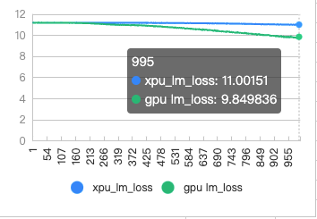
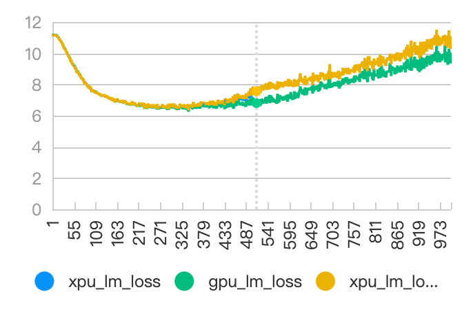
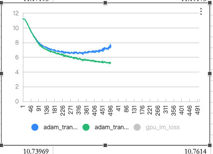
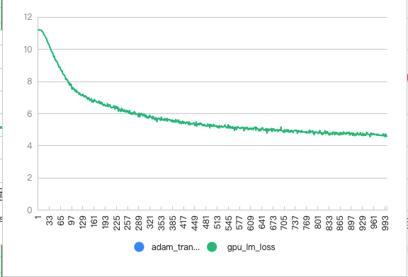
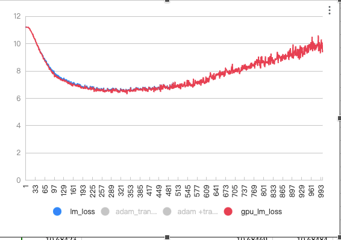

LOSS SCALE 阶段性总结

## 阶段性实验结论

1. 每一次global batch size 梯度累加后，loss需要做一次除法平均（loss/num_microbatches），因为loss过小导致backward阶段的gradient偏小，导致训练时间越长，与GPU loss diff 越大，更容易跑飞
2. num_mircobatches = global_batch_size/(micro_batch_size*DP), num_mircobatches 与 loss scale 最好是成倍数关系，比如num_mircobactes 为128时，loss scale 为256和512，*PUloss曲线更稳定。
3. 实验发现，数值域较小时（梯度0值更多时），FC FP16 误差较大。当FP32计算时，与GPU loss diff较小。

{/* truncate */}

## TODO

FC 精度模拟

## Loss Scale相关
> 注意：
> * 如下公式主要与Megatron中的概念相对应，其他框架可能需要进行概念转换，但理论是一致的。
> * Megatron中的micro batches数本质上等价于其他框架中的梯度累加步数。
> 
单卡上，反向梯度计算中$loss$与$dp\_num$之间的关系描述如下:

$$
\begin{align} 
    loss &= \frac{loss^{\prime}}{num\_micro\_batches} \cdot loss\_scale\\
    num\_micro\_batches &= \frac{GBS}{dp\_num \cdot MBS} 
\end{align}
$$

$$\Longrightarrow$$

$$
\begin{align} 
    loss &= loss^{\prime} \cdot dp\_num \cdot loss\_scale \cdot \frac{MBS}{GBS} 
\end{align}
$$

$loss^{\prime}$ 为使用当前micro batch输入计算得到的损失值。为了减少梯度求平均的计算量，会先将 $loss^{\prime}$ 除以micro batches数（这样累加后的梯度就无需再逐元素除以累加步数），然后再乘上 loss_scale 以调整梯度值到 fp16 所表示范围内。

1. loss_scale的作用是将梯度拉回到FP16所能表示的范围内，一般梯度值总是很小，故 loss_scale 主要是用于放大梯度值。因此，loss_scale取值必须要大于num_micro_batches，否则会起到反作用，即将计算得到的梯度值进行了缩小，这是必须避免的。

    * 建议将loss_scale设置为micro batches数的整数倍，可尝试2、4、8这些倍数。
    * loss_scale应尽可能取值大一些但需要避免loss或梯度上溢的情况发生。

1. 当Global Batch Size和Micro Batch Size固定不变时，调整Data Parallel 数后，需保证loss_scale与num_micro_batches的比值不变，这样才可保持计算出来的loss与调整DP前一致。

    * 根据公式(3)可知，Data Parallel 数调大N倍，则loss_scale需要调小N倍；反之，Data Parallel 数调小N倍，则loss_scale需要调大N倍。
    * 在loss_scale取较小值时，若违反该准则，则会更容易发现loss精度的不稳定性。

# 实验图表
1. 把ADAM 替换为SGD，*PU和GPU loss 曲线收敛不一致 （排除ADAM影响）

2. adam+ transformer local， *PU和gpu loss 曲线收敛不一致 （排除transformer_engine 影响）

3. `adam+ transformer local+ 删除掉clip grad` 和 ` 删除掉clip grad+删除掉loss/num_mircobatches` *PU loss 对比

4. `adam+ transformer local+ 删除掉clip grad + 删掉loss/num_mircobatches`， *PU和gpu loss对比。（完全重合）

5. `adam+ transformer local+loss/num_mircobatches, 将fc全部改为fp32运算（输入全部为fp32）`，*PU和gpuloss 完全重合，可与2（下右图）的结果做对比

