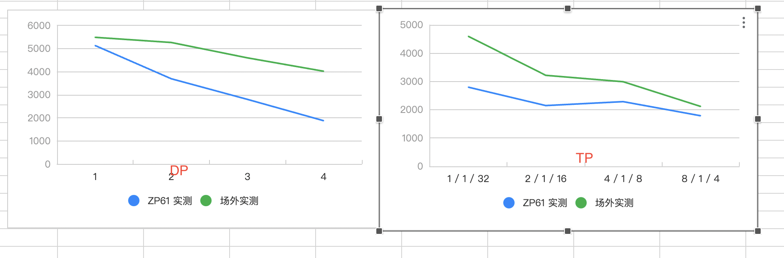
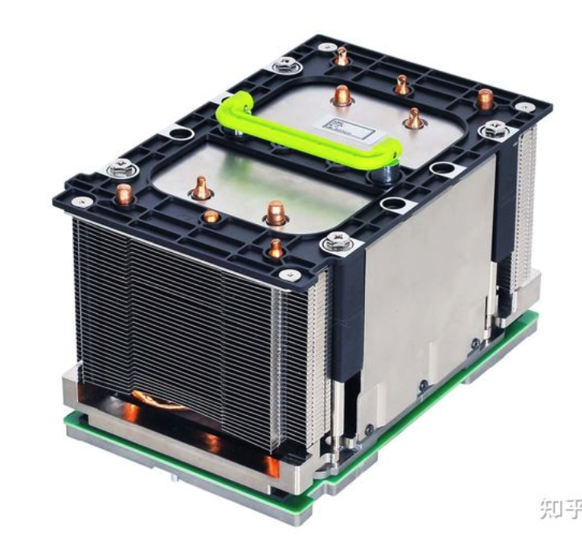
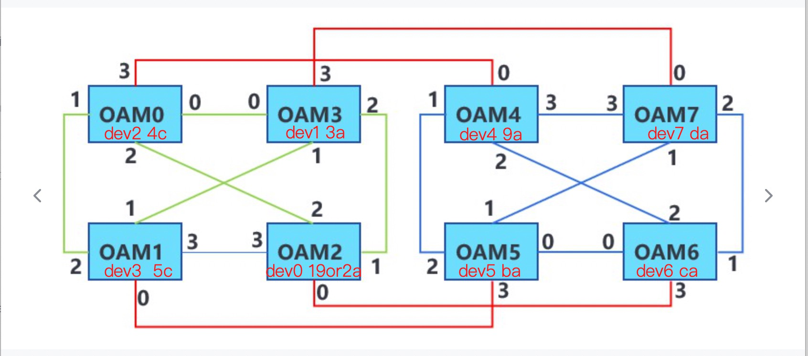
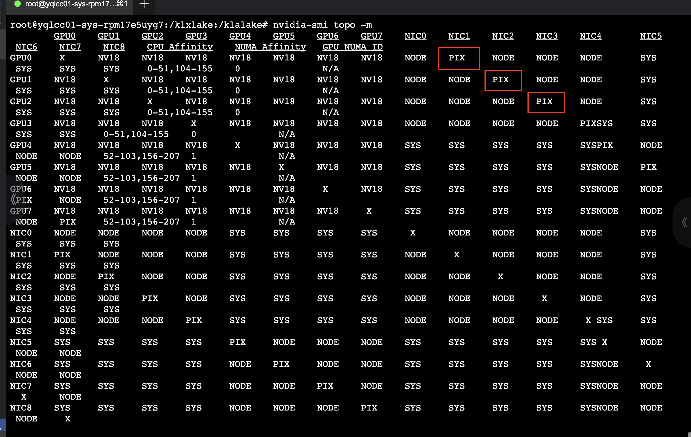
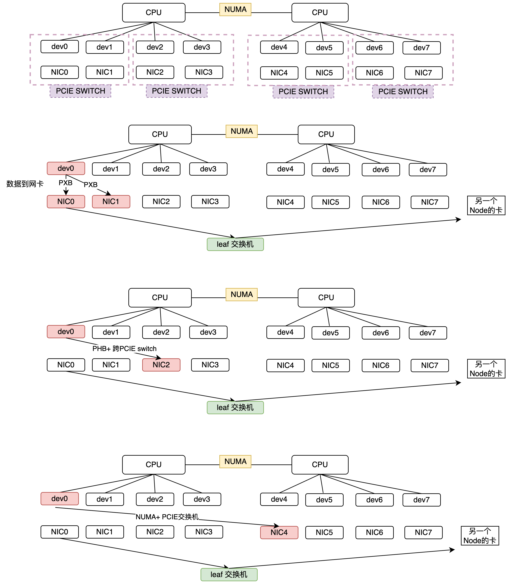

网络性能衰减Case解析

{/* truncate */}

## 问题描述

在GPU集群进行多机多卡模型性能测试时，发现性能随训练规模衰减比较严重；如上图

测试模型参数：LLaMa2 7B，训练配置为global_batch_size=128, micro_batch_size=1(该配置有意放大网络对性能的影响)。 绿色为A-GPU集群机器，蓝色为B-GPU集群机器。两个集群DP的衰减趋势严重不一致。

## 具体原因详解（浅浅挖挖）
首先OAM模组长这个样子，里面插加速卡。OAM模组提供了统一的硬件规格和接口标准，使得不同厂商生产的产品能够兼容并无缝集成到数据中心的设备中，不同设备的互操作性和数据处理效率都很高。

因为在卡外套了OAM模组，所以OAM模组之间的连接走的是LINK。**OAM_ID（物理ID）是固定的，但是device id 是不固定的（与各个厂商的操作系统bios和CPU相关，**Device ID是用于标识设备的软件标识符。它的值是可以改变的，通常是由设备的操作系统、BIOS或CPU来决定的。例如，当你更换设备的操作系统或升级设备的BIOS时，device ID可能会发生变化。**）**。

举个例子，下面这张图大家应该都看到过：`{dev2, OAM0}， {dev3, OAM1}, {dev1, OAM3}, {dev0, OAM2}, {dev4, OAM4}, {dev5, OAM5}, {dev6, OAM6}, {dev7, OAM7}`。**因为卡间通信都要通过OAM模组进行，所以我们跑模型的时候（尤其多机），有时候需要配置**`export CUDA_DEVICE_ORDER=OAM_ID`。

**但在实际网络集群中，不一定是上述devID和OAMID的对应关系。例如：C集群中对应关系为`{dev1, OAM0}, {dev0, OAM1}, {dev3, OAM2}, {dev2, OAM3}, {dev5, OAM4}, {dev4, OAM5}, {dev7, OAM6}, {dev6, OAM7}`。 **这里还有个注意点：`{0,1} {2,3}, {4,5}, {6,7}` 属于四个switch组合（这里的0，1指的是卡号）

接下来，我们再来回顾一下`nvidia-smi topo -m，`看下面的拓扑图

* NIC 之间：
    * 在同一片 CPU 上：`NODE`，表示**不需要跨 NUMA，但需要跨 PCIe 交换芯片**；
    * 不在同一片 CPU 上：`SYS`，表示**需要跨 NUMA**；

* GPU 和 NIC 之间：
    * 在同一片 CPU 上，且在同一个 PCIe Switch 芯片下面：`PXB`，表示**只需要跨 PCIe 交换芯片**；
    * 在同一片 CPU 上，且不在同一个 PCIe Switch 芯片下面：`NODE`，表示**需要跨 PCIe 交换芯片和 PCIe Host Bridge**；
    * 不在同一片 CPU 上：`SYS`，表示**需要跨 NUMA、PCIe 交换芯片，距离最远**；

参考文档：[https://arthurchiao.art/blog/gpu-advanced-notes-1-zh/](https://arthurchiao.art/blog/gpu-advanced-notes-1-zh/)

