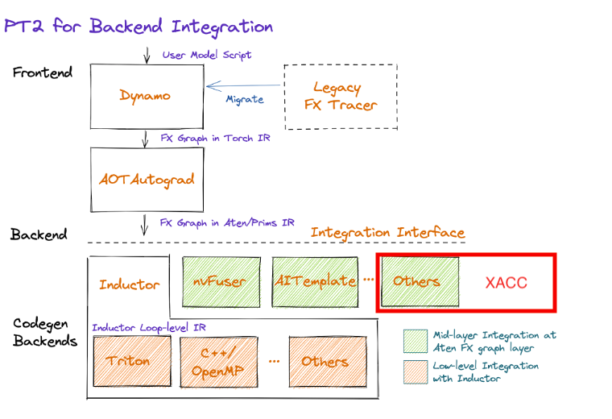
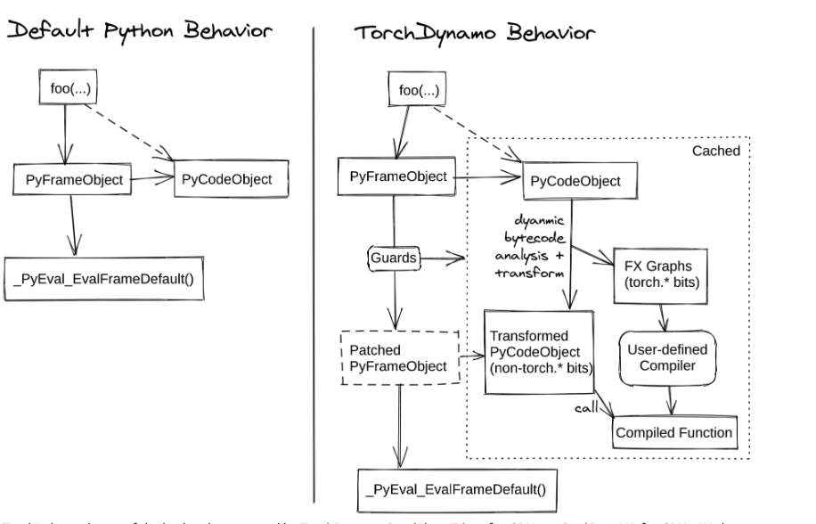
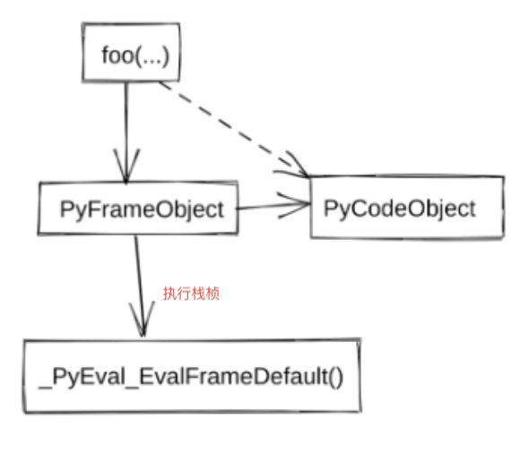
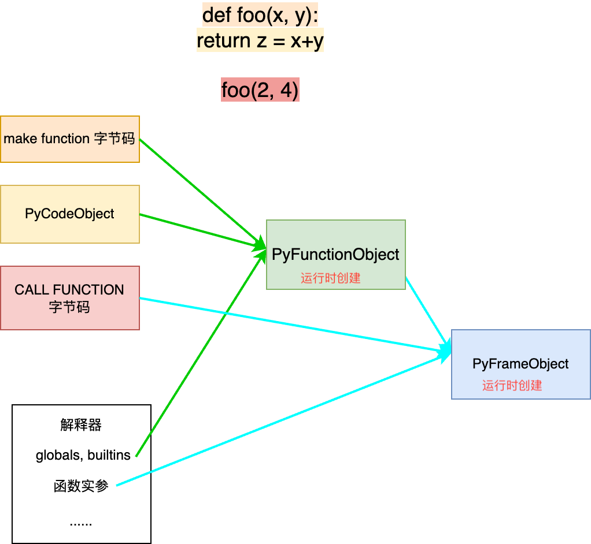
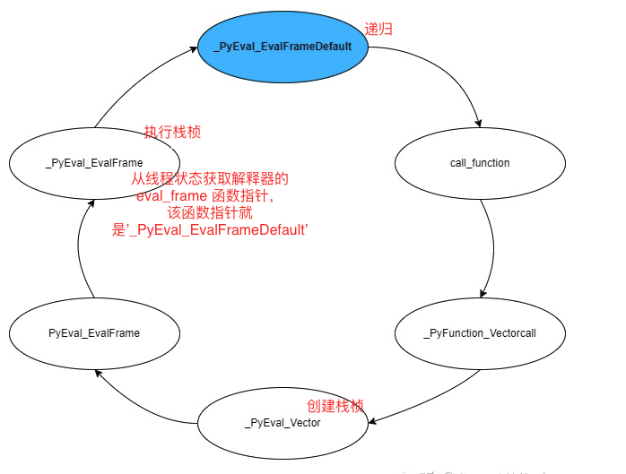
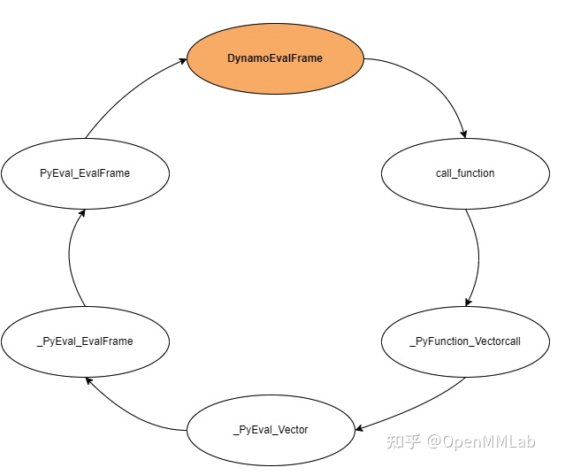
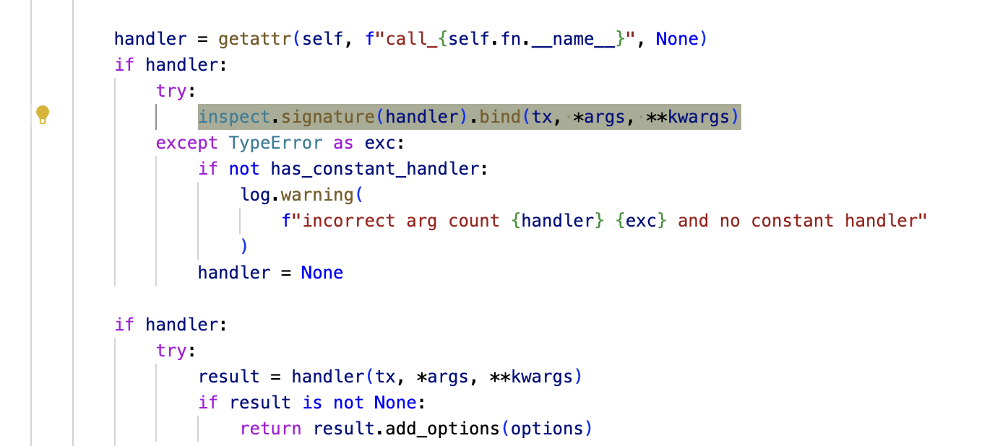
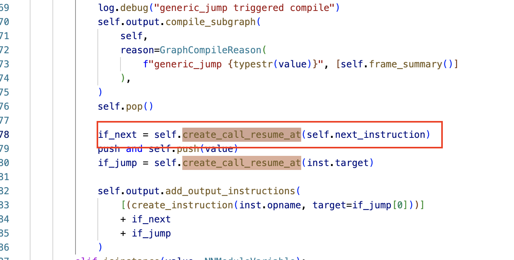
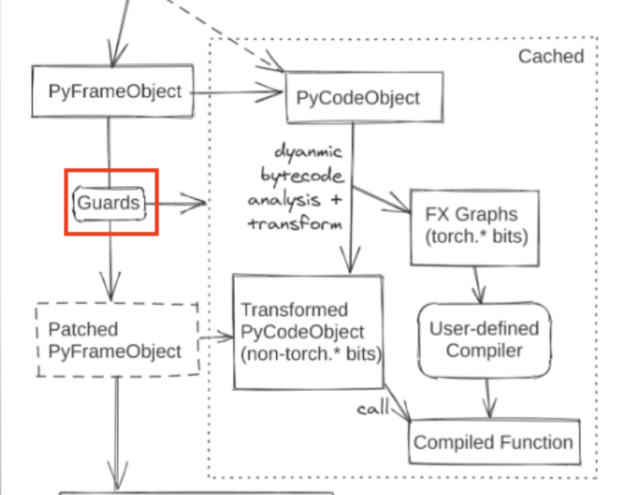
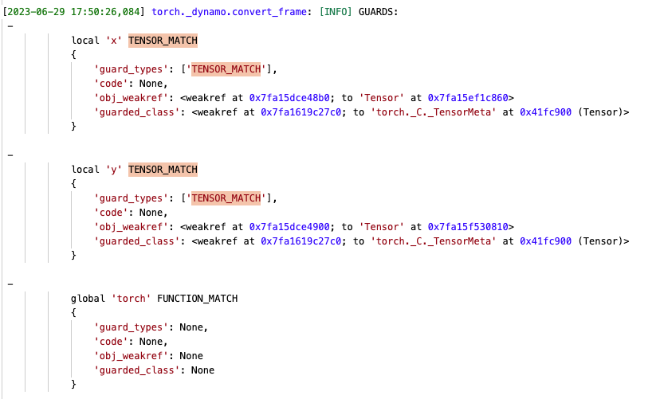

Dynamo(欢迎一键三连😊)

{/* truncate */}

## What is Dynamo

```python
@torch._dynamo.optimize(custom_compiler) # 装饰器使用 自定义backend
def fn(x, y):
    xxxxx
res = fn(torch.randn(10), torch.randn(10))

dynamo_callable = torch._dynamo.optimize(custom_compiler)(model/fn) # function API
```

```python
def fn(x, y):
    xxxx
new_fn = torch.compile(fn, backend="inductor") # compile 函数内调用optimize
```

“ PYTORCH 2.X: FASTER, MORE PYTHONIC AND AS DYNAMIC AS EVER”。



“FASTER” 和 “More Pythonic” -> torch2.0 引入了 “**a significant innovation that was a result of 5 years**” （官方发言）技术 ***Dynamo。那什么是Dynamo呢？***

     它是一个Python-level JIT compiler：hook frame evalution API （Cpython PEP 523），真正执行之前修改python字节码: 分析python operation trace fx graph，然后交给 backend compiler 自由发挥。python执行与backend compiler 混合，既有可用性又有不错的性能 （faster and more pythonic 哈哈哈）。

***那Dynamo 相比于之前torch 抓图的方式，有啥好处呢：***

相比于jit.trace/jit.script 转模型代码需要大量修改源码，dynamo会更灵活和安全。dynamo break 图逻辑是依据异常报错：当遇到一个不支持的op，比如if，while，个别aten op等等会触发捕图，不支持的aten op回到eager 执行。甚至说通过字节码我们可以捕获更多信息。下图是TrochDynamo整体结构图：首先一个python 函数对应一个PyFrameObject，该FrameObject保存了该函数所需要的全局变量、局部变量、字节码等信息。Dynamo 是将该函数对应的PyFrameObject 改掉，然后将更改后的PyFrameObject再还给python解释器执行。


## Why use Dynamo In XACC
XACC产品定位是开箱即用的compiler，开箱即用的目标是尽量不改用户代码的同时又能有不错性能；compiler 嘛则是用来提高性能。总结来说XACC的终极目标就是既要有**泛化性**又要有**性能**。

之前1.12 基于lazy tensor的图模式优化存在一些痛点：

痛点一：虽然整图优化收益更高，但inplace, view/strided 很难优雅处理。

痛点二：Shape Inference 自定义较多

痛点三：dynamic shape 不好处理

痛点四：自己维护一套逻辑较为复杂的图cache机制，印象中chenyong之前遇到过“图的输入参数顺序换了，但确命中了cache池中已编译过的图”的问题。

有没有一种方式：既可以利用eager 快速enable op kernel 的泛化特性，也可以利用图模式优化性能，同时还能缓解魔改用户代码的痛苦。当然是有的～torch2.0 的一系列新特性：dynamo, aot_autogard, prim 等都是在帮助backend compiler 提高开发，集成的体验，让更多的第三方开发者加入到pytorch生态中。

再次回到Torch2.0 backend stack 图（图一）。Dynamo 本质就是利用python VM抓图，抓出来的图经过aot_autograd funcnalized 后丢给backend compiler。

基于lazy tensor的图模式痛点，torch版本升级，栈泛化性能目标，和同事们经过了很长时间的讨论，经历了最初的lazy+eager混合模式方案，最终确定基于dynamo图优化以此达到“**泛化性能”**的目标。

## 揭开Dynamo“神秘”面纱
知道了dynamo的前世和诞生。接下来我们结合源码探寻Dyanmo，这里不涉及详细的python jit机制。除此之外还包括fx graph，aot_auto_grad, 以及少部分的inductor 图处理方式（这部分我之后放到MLIR builder的设计文档，这里内容太多了22333），因为以上这些特性在XACC 栈接FX Graph （XACC Builder）都会用以及借鉴😊。

这里可能需要提前说明：这篇文档主要聚焦在Dynamo 是如何Trace Fx Graph。实际上我们的工作（backend compiler）是在Dynamo 抓完FX Graph之后：FX Graph -> MLIR IR -> IR pass -> 返回一个执行函数。

### 替换默认python 评估frame
再回顾一遍Dynamo结构图（非常重要，建议多次👀）：


这张图真的太神了，常看常有新的发现


Python VM 里面存放的都是`PyCodeObject`（万物皆可是PyCodeObject）。所有的字节码指令和程序的静态信息都存放在`PyCodeObject`中。`PyFrameObject（函数执行时对应的栈桢）`包含：保存前一个frame，栈顶地址，栈底地址，当前执行的字节码（指令），上条字节码，内存大小，局部变量等等。

关于`PyCodeObject`和`PyFrameObject`的关系，我的理解是：


解释器对每个Frame， 都要评估Frame (Frame Evaluation)，解释器初始化时会将`tstate->interp->eval_frame`设置为默认评估frame函数，即PyEval_EvalFrameDefault。解释器执行时，执行`MAKE_FUNCTION`字节码时会创建`PyFunctionObject`；执行`CALL_FUNCTION`时创建栈桢，然后执行栈桢。调用栈流程如下


`CALL_FUNCTION`执行函数过程如下（截取了部分代码）：

```python
PyObject *
_PyEval_Vector(PyThreadState *tstate, PyFrameConstructor *con,
               PyObject *locals,
               PyObject* const* args, size_t argcount,
               PyObject *kwnames)
{
    // 创建栈帧
    PyFrameObject *f = _PyEval_MakeFrameVector(
        tstate, con, locals, args, argcount, kwnames);
    // 执行栈帧
    PyObject *retval = _PyEval_EvalFrame(tstate, f, 0);
    return retval;
}


static inline PyObject*
_PyEval_EvalFrame(PyThreadState *tstate, PyFrameObject *f, int throwflag)
{
    return tstate->interp->eval_frame(tstate, f, throwflag); // eval_frame 在初始化的时候就设置成了 '_PyEval_EvalFrameDefault'
}


PyObject* _Py_HOT_FUNCTION 
_PyEval_EvalFrameDefault(PyThreadState *tstate, PyFrameObject *f, int throwflag) // 
{
    // 连接到前一帧
    CFrame *prev_cframe = tstate->cframe;
    // 切换当前帧
    tstate->frame = f;
    PyCodeObject *co = f->f_code;
    first_instr = (_Py_CODEUNIT *) PyBytes_AS_STRING(co->co_code);
    next_instr = first_instr + f->f_lasti + 1;
   
    for (;;) {
        _Py_CODEUNIT word = *next_instr;
        opcode = _Py_OPCODE(word);
        oparg = _Py_OPARG(word);
        next_instr++;
        switch (opcode) {
            // 执行字节码
        }
    }
}
```
**基于上述简单的基础知识，我们再来看Dynamo : model内部所有的函数调用，在执行默认的eval fram之前附加一个解析frame过程，以此抓出图结构。**

咋做的咧～ [PEP 523](https://peps.python.org/pep-0523/)，更改解释器的`eval_frame`执行，将`eval_frame (_PyEval_EvalFrameDefault)`函数地址改为Dynamo 通过 [set_eval_frame](https://link.zhihu.com/?target=https%3A//github.com/pytorch/pytorch/blob/e33f1eeeb73a8d680b8aae7944011389f76faaff/torch/csrc/dynamo/eval_frame.c%23L121)  自己实现的custom frame evaluation 函数。


### ByteCode 翻译，Trace Fx Graph
了解了 Dynamo 替换`eval_frame`原理之后，我们来看一下咋做的字节码翻译。

`InstructionTranslator`类负责字节码的翻译，它包含一个`OutputGraph` (其是一个fx.tracer（保存字节码翻译后的输出，以及FxGraph）实例，还包含一个副作用的跟踪器。`我自己理解是 `InstructionTranslator`更像是模拟python 虚拟机行为，因为要过一遍函数中的所有字节码。`InstructionTranslator`记录了`instruction_pointer`（当前执行的字节码在python虚拟机的位置)，数据stack，block_stack 等信息，除此之外还可以拿到 FrameObject中的的任何信息：函数代码，局部变量，全局变量等，这些信息有利于我们trace graph。

#### 初始化`InstructionTranslator`
`InstructionTranslator`初始化过程中会先为输入变量创建`VariableTrack (Dynamo 类型系统)`: NNModuleVariable, ConstantVariable， BuiltinVariable，TorchVariable， BaseUserFunctionVariable 等等。创建`VariableTrack`的过程中还会创建 FXGraph Proxy，FX Proxy 更像是一个Graph Node的抽象，它负责串联图中node关系，每个VariableTrack 和Proxy 都是一一对应的。

```python
 class VariableBuilder:
 def _wrap(self, value):
        from ..comptime import comptime
        make_guards = self.make_guards
        if istype(value, (torch.SymInt, torch.SymFloat)):
            return self.wrap_sym(value)
        if istensor(value): # 针对函数输入的
            return self.wrap_tensor(value)
            
def wrap_tensor(self, value: torch.Tensor): 
    # 创建FakeTensors，不发生真实内存分配的Tensor
    tensor_variable = wrap_fx_proxy( # 创建FX Proxy 和 FX Node，通过该函数，graph的nodes以及node的连接关系都搭建起来了。该函数做了很多事情～之后再来详细说下
                tx=self.tx,
                proxy=tensor_proxy,
                example_value=value,
                guards=self.make_guards(GuardBuilder.TENSOR_MATCH), # 为每个tensor创建guard
                should_specialize=self.tensor_should_specialize(),
                ignore_subclass=ignore_subclass,
                source=self.get_source(),
            ) 
```
**在创建 **`VariableTracker`**的过程中，Dynamo 在 FX Graph 中创建了 FX Proxy、添加了 Guard（后续会展开说明什么是Guard）、创建了**`FakeTensor`**，初始化**`VariableTracker`。

#### Run `InstructionTranslator`：字节码翻译
```python
 class InstructionTranslatorBase(Checkpointable[InstructionTranslatorGraphState]):
 def run(self):
        try:
            self.output.push_tx(self)
            while (
                self.instruction_pointer is not None
                and not self.output.should_exit
                and self.step() # 每次step处理一个字节码指令，从python虚拟机中获取当前处理字节码指令的地址
            ):
                pass
```
逐条翻译字节码，依次创建函数内需要的所有局部变量。***捕捉到异常或者 ***`RETURN_VALUE`*** 指令时触发图编译***。在数据栈为空、且应该编译子图的条件下，`InstructionTranslatorBase` 会备份当前状态为 checkpoint，以便以后用于恢复。是否触发编译子图，取决于当前 block stack 中的所有条目是否都可以恢复、并且用户没有通过 `one_graph` 或 `nopython` 指定全图编译。

```python
def step(self):
        """Process exactly one instruction, return False we should exit"""
        assert isinstance(self.instruction_pointer, int)
        inst = self.instructions[self.instruction_pointer] # instruction_pointer 获取当前 step 要处理的字节码指令
        self.current_instruction = inst
        self.instruction_pointer += 1

        log.debug(f"TRACE {inst.opname} {inst.argval} {self.stack}")

        try:
            if not hasattr(self, inst.opname):
                unimplemented(f"missing: {inst.opname}")
            getattr(self, inst.opname)(inst) # 翻译每条字节码
            return inst.opname != "RETURN_VALUE"
        except Unsupported as exc:
            exc.real_stack.append(self.frame_summary())
            if self.empty_checkpoint():
                raise
            log.debug("step triggered compile", exc_info=True) # 捕获异常，触发子图编译
            
        self.output.compile_subgraph( # 后端编译子图
            self,
            partial_convert=True,
            reason=GraphCompileReason("step_unsupported", [self.frame_summary()]),
        )
```
举例说明～

```python
@torch._dynamo.optimize(backend="inductor")
def fn(x, y):
    a = torch.cos(x)
    b = torch.sin(a)
    return a + b + y

103           0 LOAD_GLOBAL              0 (torch)
              2 LOAD_METHOD              1 (cos)
              4 LOAD_FAST                0 (x)
              6 CALL_METHOD              1
              8 STORE_FAST               2 (a)

104          10 LOAD_GLOBAL              0 (torch)
             12 LOAD_METHOD              2 (sin)
             14 LOAD_FAST                2 (a)
             16 CALL_METHOD              1
             18 STORE_FAST               3 (b)

105          20 LOAD_FAST                2 (a)
             22 LOAD_FAST                3 (b)
             24 BINARY_ADD
             26 LOAD_FAST                1 (y)
             28 BINARY_ADD
             30 RETURN_VALUE
```
逐条解析字节码：

1. **Offset 0，** [LOAD_GLOBAL](https://github.com/pytorch/pytorch/blob/fe05266/torch/_dynamo/symbolic_convert.py#L688): `inst.argval` 为 `torch`，它从 `f_globals` 中取出库 `torch`，调用 `VariableBuilder(self, source)(value)` 在 [builder.py#L391-L395](https://github.com/pytorch/pytorch/blob/fe05266/torch/_dynamo/variables/builder.py#L391-L395) 创建了 [TorchVariable](https://github.com/pytorch/pytorch/blob/fe05266/torch/_dynamo/variables/torch.py#L123)，含义是 PyTorch 中的某个 package，并创建了 `FUNCTION_MATCH` 类型的 `Guard`。最后把该 `TorchVariable` 入栈，此时栈上的内容为 `[TorchVariable(torch)]`。

```python
def LOAD_GLOBAL(self, inst):
    # ...
    name = inst.argval
    # ...
    try:
        value = self.f_globals[name]
    except KeyError:
        return self.load_builtin(inst)

    source = self.get_global_source(name)
    self.push(VariableBuilder(self, source)(value))
```
2. **Offset 2**, [LOAD_METHOD](https://github.com/pytorch/pytorch/blob/fe05266fda4f908130dea7cbac37e9264c0429a2/torch/_dynamo/symbolic_convert.py#L1056),  [LOAD_ATTR](https://github.com/pytorch/pytorch/blob/fe05266/torch/_dynamo/symbolic_convert.py#L1063): 先出栈一个元素，即 `TorchVariable(torch)`，然后为 `getattr` 创建了 [BuiltinVariable](https://github.com/pytorch/pytorch/blob/fe05266/torch/_dynamo/variables/builtin.py#L367)、为 `inst.argval`（即 `cos`） 创建了 [ConstantVariable](https://github.com/pytorch/pytorch/blob/fe05266/torch/_dynamo/variables/constant.py#L13)，转入 [call_function()](https://github.com/pytorch/pytorch/blob/fe05266/torch/_dynamo/variables/builtin.py#L428)，**对应着在 Dynamo 中执行类似 Python 的 **`getattr(torch, cos)`** 的功能。**这里VariableTrack执行propagate()：收集输入中的所有 Guard，然后尝试将参数绑定到call_getattr上，然后再去调用call_getattr()，call_getattr() 执行propagate(): 收集输入中的所有Guard，然后创建TorchVariable(torch.cos) 。此时栈上的内容为 `[TorchVariable(torch.cos)]`

```python
def LOAD_METHOD(self, inst):
        self.LOAD_ATTR(inst)
        self.push(self.pop())
        self.push(None)
        
 def LOAD_ATTR(self, inst):
        obj = self.pop()
        result = BuiltinVariable(getattr).call_function(
            self, [obj, ConstantVariable(inst.argval)], {}
        )
        self.push(result)
```


3. **Offset 4**, [LOAD_FAST](https://github.com/pytorch/pytorch/blob/fe05266/torch/_dynamo/symbolic_convert.py#L633): `inst.argval` 为 x，从 `symbolic_locals(局部变量)` 取出 变量 x 的 `TensorVariable`，然后把它压到栈上，栈上的内容为 `TorchVariable(torch.cos),TensorVariable(x)]`。

```python
def LOAD_FAST(self, inst):
        name = inst.argval

        if name in self.f_locals and config.replay_record_enabled:
            self.exec_recorder.add_local_var(name, self.f_locals[name])

        if name.startswith(".") and name not in self.symbolic_locals:
            # This happens in dict/list comprehensions
            name = name.replace(".", "implicit")
        assert name not in self.cell_and_freevars()
        if name not in self.symbolic_locals:
            unimplemented("undefined LOAD_FAST")
        self.push(self.symbolic_locals[name])
        if name.startswith("___stack"):
            self.symbolic_locals.pop(name)
```
4. **Offset 6**,  `CALL_METHON`中实际上调用的还是[CALL_FUNCTION](https://github.com/pytorch/pytorch/blob/fe05266/torch/_dynamo/symbolic_convert.py#L988): 因为 `CALL_FUNCTION` 被装饰器 [break_graph_if_unsupported()](https://github.com/pytorch/pytorch/blob/fe05266/torch/_dynamo/symbolic_convert.py#L341) 装饰，所以执行 `CALL_FUNCTION()` 会先经过其中的 `wrapper()`。这里首先创建 checkpoint，保存了所有的状态，以便在后面出现异常时从 checkpoint 中恢复。 然后执行 `inner_fn(self, inst)`，`inner_fn` 就是 `CALL_FUNCTION()`，其中先出栈 N 个元素作为函数参数，N 由 `inst.argval` 指定，这里是 1，然后再出栈 1 个元素作为函数参数，通过 [InstructionTranslatorBase.call_function()](https://github.com/pytorch/pytorch/blob/fe05266/torch/_dynamo/symbolic_convert.py#L469) 进行函数调用。


`InstructionTranslatorBase.call_function()` 调用 [TorchVariable.call_function()](https://github.com/pytorch/pytorch/blob/fe05266/torch/_dynamo/variables/torch.py#L181)，**Dynamo 在此处模拟执行 **`torch.cos(x)`。首先用 `propagate()` 收集所有参数中的 `Guard`，然后匹配到 [torch.py##L565-L573](https://github.com/pytorch/pytorch/blob/fe05266/torch/_dynamo/variables/torch.py#L565-L573)，此处 [proxy_args_kwargs()](https://github.com/pytorch/pytorch/blob/fe05266/torch/_dynamo/utils.py#L428) 从 `TensorVariable(a)` 获取 `torch.fx.Proxy(a)`，它是在初始化 `symbolic_locals` 时创建的，然后通过 [create_proxy()](https://github.com/pytorch/pytorch/blob/fe05266/torch/_dynamo/output_graph.py#L783) 创建了新的 `Proxy`，类型是 `call_function`，目标是 `torch.cos`，参数是 x。最后通过 [wrap_fx_proxy](https://github.com/pytorch/pytorch/blob/fe05266/torch/_dynamo/variables/builder.py#L864) 创建了新的 `TensorVariable` 来保存结果，收集到的 `Guard` 信息也附加了上去，一路返回后并在 [call_function()](https://github.com/pytorch/pytorch/blob/fe05266/torch/_dynamo/symbolic_convert.py#L469) 处将结果压栈，栈上的内容为 `[TensorVariable(torch.cos(x))]`

```python
def CALL_METHOD(self, inst):
        args = self.popn(inst.argval)
        dummy = self.pop()
        assert dummy is None
        fn = self.pop()
        self.call_function(fn, args, {})
     
@break_graph_if_unsupported(push=1)
def CALL_FUNCTION(self, inst):
    args = self.popn(inst.argval)
    fn = self.pop()
    self.call_function(fn, args, {})
```
5. **Offset 8**, [STORE_FAST](https://github.com/pytorch/pytorch/blob/fe05266/torch/_dynamo/symbolic_convert.py#L659:STORE_FAST):  出栈栈顶元素，然后将其放入到`symbolic_locals(局部变量)`。栈上的内容为 `[]`

```python
def STORE_FAST(self, inst):
        self.symbolic_locals[inst.argval] = self.pop()
```
6. 依次类推 `LOAD_GLOBAL` `LOAD_METHOD` `LOAD_FAST` `CALL_METHOD` `LOAD_FAST LOAD_FAST`。最后栈上的内容为 `[TensorVariable(a),TensorVariable(b)]`
7. **Offset 24**, [BINARY_ADD](https://github.com/pytorch/pytorch/blob/fe05266/torch/_dynamo/symbolic_convert.py#L1479): `InstructionTranslatorBase` 对常见的 Python 内建函数用 [stack_op](https://github.com/pytorch/pytorch/blob/fe05266/torch/_dynamo/symbolic_convert.py#L144) 做了封装和转发，其中 `BINARY_ADD = stack_op(operator.add)`。

```python
BINARY_ADD = stack_op(operator.add)

def stack_op(fn: typing.Callable[..., object]):
    nargs = len(inspect.signature(fn).parameters)
    fn_var = BuiltinVariable(fn)

    @functools.wraps(fn)
    def impl(self: "InstructionTranslatorBase", inst: Instruction):
        self.push(fn_var.call_function(self, self.popn(nargs), {}))

    return impl
```
其中，`fn_var` 是创建闭包时创建的 [BuiltinVariable](https://github.com/pytorch/pytorch/blob/fe05266/torch/_dynamo/variables/builtin.py#L367)，需要出栈的参数个数由 `inspect.signature(fn)` 确定，对于 `operator.add` 来说需要 2 个参数，因此出栈 `TensorVariable(a)` 和 `TensorVariable(b)`，随后转到 [BuiltinVariable.call_function()](https://github.com/pytorch/pytorch/blob/fe05266/torch/_dynamo/variables/builtin.py#L428)，其中调用 `propagate()` 从输入的 `VariableTracker` 中收集 `Guard`，分别是针对变量 x 的 `TENSOR_MATCH` 和针对 torch 的 `FUNCTION_MATCH`。 此时栈内容`TensorVariable(a+b)`

8.  依次类推 `LOAD_FAST`和 `BINARY_ADD`, 最后栈的内容为 `TensorVariable(y+a+b)`
9.  **Offset 30**,  RETURN_VALUE， 触发compile graph（之后再说这里）

Hi Hi Shape Infer ✨✨✨

有个点很好玩～最早的时候一直没有想明白 “FX Graph的时候什么时候做的shape infer”。其实就是在 `wrap_fx_proxy`中

通过 `example_value = get_fake_value(proxy.node, tx)` **从 FX Node 中创建 **`FakeTensor`**、并以 **`FakeTensor`** 运行该节点所代表的算子**，实现在 [get_fake_value()](https://github.com/pytorch/pytorch/blob/fe05266/torch/_dynamo/utils.py#L1120)。**根据Dispatcher机制，它可以在 Python 层面捕获到 PyTorch 最底层的 ATen 算子或者是prim算子。**

```
home/pytorch2.0/torch/_dynamo/variables/torch.py(548)call_function() # call_function调用，然后在该function里会逐步调用到torch.ops函数。
-> tensor_variable = wrap_fx_proxy( # wrap_fx_proxy 
  /home/pytorch2.0/torch/_dynamo/variables/builder.py(756)wrap_fx_proxy()
-> return wrap_fx_proxy_cls(
  /home/pytorch2.0/torch/_dynamo/variables/builder.py(791)wrap_fx_proxy_cls()
-> example_value = get_fake_value(proxy.node, tx). # 这里从FX Node中创建FakeTensor，
  /home/pytorch2.0/torch/_dynamo/utils.py(1152)get_fake_value()
-> return wrap_fake_exception(
  /home/pytorch2.0/torch/_dynamo/utils.py(808)wrap_fake_exception()
-> return fn()
  /home/pytorch2.0/torch/_dynamo/utils.py(1153)<lambda>()
-> lambda: run_node(tx.output, node, args, kwargs, nnmodule) # 以FakeTensors 运行算子
  /home/pytorch2.0/torch/_dynamo/utils.py(1194)run_node() 
-> return node.target(*args, **kwargs)      # 这里开始torch.dispatch 到op的对应function
  /home/pytorch2.0/torch/utils/_stats.py(20)wrapper()
-> return fn(*args, **kwargs)
  /home/pytorch2.0/torch/_subclasses/fake_tensor.py(987)__torch_dispatch__()
-> return self.dispatch(func, types, args, kwargs)
  /home/pytorch2.0/torch/_subclasses/fake_tensor.py(1170)dispatch()
-> r = func(*args, **kwargs)
  /home/pytorch2.0/torch/_ops.py(287)__call__()
-> return self._op(*args, **kwargs or {})
  /home/pytorch2.0/torch/_prims_common/wrappers.py(220)_fn()
-> result = fn(*args, **kwargs)
  /home/pytorch2.0/torch/_prims_common/wrappers.py(344)_fn()
-> return fn(*args, **kwargs)
  /home/pytorch2.0/torch/_prims_common/wrappers.py(130)_fn()
-> result = fn(**bound.arguments) # 这里的bound.arguments 要确保是fake tensors
  /home/pytorch2.0/torch/_refs/__init__.py(402)_ref()
-> return prim(a)
  /home/pytorch2.0/torch/_refs/__init__.py(507)cos()
-> return prims.cos(a).   # 这里调到cos function
  /home/pytorch2.0/torch/_ops.py(287)__call__()
-> return self._op(*args, **kwargs or {})
  /home/pytorch2.0/torch/_prims/__init__.py(388)_elementwise_meta()
```
#### 触发编译subgraph的几种场景：
1. return_value
2. generic_jump（if-else 分支语句）
3. step (python 字节码当中的step)
4. STORE_ATTR ：副作用，全局状态的改变。
5. break_graph_if_unsupported (调用call function如果不支持，则出发trigger compile)

触发子图之后会进入`compile_subgraph`

```python
self.restore_graphstate(state)
self.output.compile_subgraph(self, reason=reason)
self.popn(push - dis.stack_effect(inst.opcode, inst.arg))
```
1. 分析live variable, 从`symbolic_locals`remove dead variable
2. 接着上面🌰：进入compile_subgraph后，栈的内容为`TensorVariable(y+a+b)`

```python
  def compile_subgraph(
        self, tx, partial_convert=False, reason: Optional[GraphCompileReason] = None
    ):
 # optimization to generate better code in a common case
            self.add_output_instructions(
                self.compile_and_call_fx_graph(tx, list(reversed(stack_values)), root) # stack_val: TensorVariable(y+a+b)
                + [create_instruction("UNPACK_SEQUENCE", len(stack_values))]
            )
```
[compile_and_call_fx_graph()](https://github.com/pytorch/pytorch/blob/fe05266/torch/_dynamo/output_graph.py#L583) 用于 **从 **`OutputGraph`** 中生成代码**。其中首先根据传入的两个输出节点更新了 Guard，[create_node()](https://github.com/pytorch/pytorch/blob/fe05266/torch/_dynamo/output_graph.py#L823) 在 FX Graph 中创建了类型为 `output` 的 FX Proxy，**一张完整的 FX Graph 到此构建完毕**。[remove_unused_graphargs()](https://github.com/pytorch/pytorch/blob/fe05266/torch/_dynamo/output_graph.py#L724) 从 FX Graph 中删除没有 `user` 的节点。`fx.GraphModule(root, self.graph)` 从 `fx.Graph` 创建 `fx.GraphModule`，通过 [recompile()](https://github.com/pytorch/pytorch/blob/fe05266/torch/fx/graph_module.py#L634) 生成对应的 Python 代码，生成的python代码通过python 内置函数`exec`编译为字节码（可执行函数），新编译的函数名为 `__compiled_fn_0()`，作为GraphModule的Forward函数，

```python
    def compile_and_call_fx_graph(self, tx, rv, root):
        """
        Generate code from self.graph and return the Instruction()s to
        call that generated code.
        """
        from .eval_frame import disable
        
        for output in rv:
            self.guards.update(output.guards) # 更新guards

        # 创建最后一个 output node: TensorVariable(y+a+b)
        self.create_node(
            "output", "output", (self.create_arg(tuple(x.as_proxy() for x in rv)),), {}
        )
        #删除没有用到的graph args
        self.remove_unused_graphargs()
        ncalls = count_calls(self.graph)
        counters["stats"]["calls_captured"] += ncalls
        counters["stats"]["fusions_possible"] += ncalls - 1

        # free a bit of memory
        for node in self.graph.nodes:
            if "example_value" in node.meta:
                del node.meta["example_value"]
        self.real_value_cache.clear()

        gm = fx.GraphModule(root, self.graph)  # 哈哈哈 这个地方就创建出来了graphmoduler～～
        gm.recompile()  # 这个地方要生成对应的python code。通过生成python code来获得改写后的字节码
        gm.compile_subgraph_reason = self.compile_subgraph_reason
        name = unique_id("__compiled_fn")

        assert_no_fake_params_or_buffers(gm)
        with tracing(self.tracing_context):
            compiled_fn = self.call_user_compiler(gm) # 调用backend compiler 提供的compile 函数编译gm
        compiled_fn = disable(compiled_fn) # 已经编译过的函数不会再第二次编译
        counters["stats"]["unique_graphs"] += 1
        self.install_global(name, compiled_fn)
        
        cg = PyCodegen(tx) # 生成字节码
        cg.make_call_generated_code(name)
        return cg.get_instructions()
```

```python
#原始函数：
def fn(x, y):
    a = torch.cos(x)
    b = torch.sin(a)
    return a + b + y

def forward(self, x : torch.Tensor, y : torch.Tensor):
    cos = torch.cos(x);  x = None
    sin = torch.sin(cos)
    add = cos + sin;  cos = sin = None
    add_1 = add + y;  add = y = None
    return (add_1,)
```

> 插播：如何将FXGraph 转为python代码：首先把一些内置名称添加到全局命名空间，例如 `inf, nan, None, torch `。然后依次遍历图中的每个节点，找到每个节点最后被使用的地方，从而在代码生成的过程中及时释放不用的节点。改写完的python字节码：

```
0 LOAD_GLOBAL              3 (__compiled_fn_0)
2 LOAD_FAST                0 (x)
4 LOAD_FAST                1 (y)
6 CALL_FUNCTION            2
8 UNPACK_SEQUENCE          1
10 RETURN_VALUE
```
对应的FX Graph 为：

```
__compiled_fn_0 <eval_with_key>.5 opcode         name    target                                                  args         kwargs
-------------  ------  ------------------------------------------------------  -----------  --------
placeholder    x       x                                                       ()           {}
placeholder    y       y                                                       ()           {}
call_function  cos     <built-in method cos of type object at 0x7fb5189f8800>  (x,)         {}
call_function  sin     <built-in method sin of type object at 0x7fb5189f8800>  (cos,)       {}
call_function  add     <built-in function add>                                 (cos, sin)   {}
call_function  add_1   <built-in function add>                                 (add, y)     {}
output         output  output                                                  ((add_1,),)  {}
```
至此compile subgraph 算是基本完成了。

### Multi-Subgraph
举个🌰：

```python
def toy_example(a, b):
    x = a / (torch.abs(a) + 1)
    if b.sum() < 0:
        b = b * -1
    return x * b
for _ in range(100):
    toy_example(torch.randn(10), torch.randn(10))s
```
```
224           0 LOAD_FAST                0 (a)
              2 LOAD_GLOBAL              0 (torch)
              4 LOAD_METHOD              1 (abs)
              6 LOAD_FAST                0 (a)
              8 CALL_METHOD              1
             10 LOAD_CONST               1 (1)
             12 BINARY_ADD
             14 BINARY_TRUE_DIVIDE
             16 STORE_FAST               2 (x)

225          18 LOAD_FAST                1 (b)
             20 LOAD_METHOD              2 (sum)
             22 CALL_METHOD              0
             24 LOAD_CONST               2 (0)
             26 COMPARE_OP               0 (<)
             28 POP_JUMP_IF_FALSE       38  # 触发子图编译

226          30 LOAD_FAST                1 (b)
             32 LOAD_CONST               3 (-1)
             34 BINARY_MULTIPLY
             36 STORE_FAST               1 (b)

227     >>   38 LOAD_FAST                2 (x)
             40 LOAD_FAST                1 (b)
             42 BINARY_MULTIPLY
             44 RETURN_VALUE
```
`POP_JUMP_IF_FALSE`触发子图编译，第一张FX Graph 如下：

```
 __compiled_fn_0 <eval_with_key>.5 opcode         name     target                                                  args              kwargs
-------------  -------  ------------------------------------------------------  ----------------  --------
placeholder    a        a                                                       ()                {}
placeholder    b        b                                                       ()                {}
call_function  abs_1    <built-in method abs of type object at 0x7f4cbadc8800>  (a,)              {}
call_function  add      <built-in function add>                                 (abs_1, 1)        {}
call_function  truediv  <built-in function truediv>                             (a, add)          {}
call_method    sum_1    sum                                                     (b,)              {}
call_function  lt       <built-in function lt>                                  (sum_1, 0)        {}
output         output   output                                                  ((truediv, lt),)  {}
```

对应的python 函数为：
```python
def forward(self, a : torch.Tensor, b : torch.Tensor):
    abs_1 = torch.abs(a)
    add = abs_1 + 1;  abs_1 = None
    truediv = a / add;  a = add = None
    sum_1 = b.sum();  b = None
    lt = sum_1 < 0;  sum_1 = None
    return (truediv, lt)
```
改写后的字节码如下：

```
222           0 LOAD_GLOBAL              3 (__compiled_fn_0) # 对应上述流程，前面也举了例子讲，有兴趣可以自己推一下。
              2 LOAD_FAST                0 (a) # compiled_fn_0
              4 LOAD_FAST                1 (b)
              6 CALL_FUNCTION            2
              8 UNPACK_SEQUENCE          2 # 用于拆分作为元组返回的函数结果
              # 栈上还有TensorVariable x (live tensor) 作为 TensorVariable之后还会被用到
             10 STORE_FAST               2 (x) 
             12 POP_JUMP_IF_FALSE       24
             14 LOAD_GLOBAL              4 (__resume_at_30_1) # if 为True的字节码指令 30_1 是指令的偏移量
             16 LOAD_FAST                1 (b)
             18 LOAD_FAST                2 (x)
             20 CALL_FUNCTION            2
             22 RETURN_VALUE
        >>   24 LOAD_GLOBAL              5 (__resume_at_38_2) # if 为False的字节码指令
             26 LOAD_FAST                1 (b)
             28 LOAD_FAST                2 (x)
             30 CALL_FUNCTION            2
             32 RETURN_VALUE
             
```



```python
    def create_call_resume_at(self, inst):
        self.instruction_pointer = None

        if inst.opname == "RETURN_VALUE":
            return [create_instruction("RETURN_VALUE")]

        reads = livevars_analysis(self.instructions, inst) # 分析活跃的字节码
        argnames = tuple(
            k
            for k in self.symbolic_locals.keys()
            if k in reads and k not in self.cell_and_freevars()
        )
        nargs = len(self.stack) + len(argnames)

        name = unique_id(f"__resume_at_{inst.offset}")

        new_code: types.CodeType = ContinueExecutionCache.lookup( # 查不到就会生成新的代码
            self.f_code,
            self.lineno,
            inst.offset,
            len(self.stack),
            argnames,
            tuple(b.resume_fn() for b in self.block_stack),
        )
        
        # Notice: 这里生成的python 代码还没有进行编译
   
        cg = PyCodegen(self)

        if new_code.co_freevars:
            cg.make_function_with_closure(name, new_code, len(self.stack))
        else:
            self.output.install_global(
                name, types.FunctionType(new_code, self.f_globals, name)
            )
            cg.extend_output(cg.load_function_name(name, len(self.stack)))

        cg.extend_output([cg.create_load(k) for k in argnames])
        cg.extend_output(
            [
                create_instruction("CALL_FUNCTION", nargs),
                create_instruction("RETURN_VALUE"),
            ]
        )
         # 14 LOAD_GLOBAL              4 (__resume_at_30_1) # if 为True的字节码指令 30_1 是指令的偏移量
         # 16 LOAD_FAST                1 (b)
         # 18 LOAD_FAST                2 (x)
         # 20 CALL_FUNCTION            2
         # 22 RETURN_VALUE
        return cg.get_instructions()
```
总结一下：原始函数的字节码中第一次dynamo编译完成后，新的字节码中多了三次`CALL_FUNCTION`。

### Eexcute 执行
子图编译完之后会返回到 `_custom_eval_frame()该代码在evel_frame.c 中`:

```c
static PyObject* _custom_eval_frame_shim(
    PyThreadState* tstate,
    THP_EVAL_API_FRAME_OBJECT* frame,
    int throw_flag) {
  // Shims logic into one of three states. Can probably be refactored into a
  // single func, later:
  //  - None: disables TorchDynamo
  //  - False: run-only mode (reuse existing compiles)
  //  - Python callable(): enables TorchDynamo
  PyObject* callback = eval_frame_callback_get();

  if (callback == Py_None) {
    return eval_frame_default(tstate, frame, throw_flag);
  }

  return _custom_eval_frame(tstate, frame, throw_flag, callback); # 这里这里～～
}
```

```c
PyObject* result =
    call_callback(callback, frame, cache_size(extra));
if (result == NULL) {
  // internal exception, returning here will leak the exception into user code
  // this is useful for debugging -- but we dont want it to happen outside of
  // testing
  return NULL;
} else if (result != Py_None) {
  DEBUG_TRACE("create cache %s", name(frame));
  extra = create_cache_entry(extra, result);
  Py_DECREF(result);
  set_extra(frame->f_code, extra);
  // Re-enable custom behavior
  eval_frame_callback_set(callback); // 重置回调函数：
  return eval_custom_code(tstate, frame, extra->code, throw_flag); // 创建PyFrameObject，并运行。frame->f_code 原始function 字节码，extra->code 是dynamo编译完成的function字节码。
} else {
  DEBUG_TRACE("create skip %s", name(frame));
  Py_DECREF(result);
  destroy_cache_entry(extra);
  set_extra(frame->f_code, SKIP_CODE);
  // Re-enable custom behavior
  eval_frame_callback_set(callback);
  return eval_frame_default(tstate, frame, throw_flag);
}
```
以上面带有控制流的修改后的字节码为例：

```
222           0 LOAD_GLOBAL              3 (__compiled_fn_0) # 对应上述流程，前面也举了例子讲，有兴趣可以自己推一下。
              2 LOAD_FAST                0 (a) # compiled_fn_0
              4 LOAD_FAST                1 (b)
              6 CALL_FUNCTION            2
              8 UNPACK_SEQUENCE          2 # 用于拆分作为元组返回的函数结果
              # 栈上还有TensorVariable x (live tensor) 作为 TensorVariable之后还会被用到
             10 STORE_FAST               2 (x) 
             12 POP_JUMP_IF_FALSE       24
             14 LOAD_GLOBAL              4 (__resume_at_30_1) # if 为True的字节码指令 30_1 是指令的偏移量
             16 LOAD_FAST                1 (b)
             18 LOAD_FAST                2 (x)
             20 CALL_FUNCTION            2
             22 RETURN_VALUE
        >>   24 LOAD_GLOBAL              5 (__resume_at_38_2) # if 为False的字节码指令
             26 LOAD_FAST                1 (b)
             28 LOAD_FAST                2 (x)
             30 CALL_FUNCTION            2
             32 RETURN_VALUE
```
**在没有Dynamo 的上下文下中**执行`__compiled_fn_0`(已编译的function 不会再触发Dynamo编译)，**这个过程与 PyTorch 以 eager 模式执行一个函数一样。**

**     执行完编译过的子图 **`__compiled_fn_0()`**，程序返回到 Python 解释器，解释器执行遇到的字节码是 **`POP_JUMP_IF_FALSE 24`时， 会从 Python 虚拟机栈顶取出一个元素，将其转化为 `bool` 类型，根据结果判断是否跳转。此时的栈顶为 Tensor `b.sum() < 0`，Python 虚拟机调用 `THPVariable_bool_scalar()` 将其转为 `bool` 值，此次求值结果为 `False`，因此跳转到 offset 24 处 开始继续执行。

     Offset 24 处是此前 Dynamo 由于 graph break 而创建的函数 `__resume_at_38_2()`。**执行该 Python 函数会触发 Dynamo 设置的 Frame Evaluation 函数 **`custom_eval_frame_shim()`，在 [_custom_eval_frame()](https://github.com/pytorch/pytorch/blob/fe05266/torch/csrc/dynamo/eval_frame.c#L640) 检查 `__resume_at_38_2()` 是否在缓存池中已经有编译好的结果了，因为是第一次编译该函数，此处发生 cache miss，所以通过 `call_callback()` 调用设置好的回调函数 [catch_errors](https://github.com/pytorch/pytorch/blob/fe05266/torch/_dynamo/eval_frame.py#L362)，**针对 **`__resume_at_38_2()`** 开启一次全新的子图编译过程**。

 值得注意的是：每一次的函数调用都会新建一个PyFrameObject

### Guards
我们再来看下一个很重要的模块：`Guards`, 它有多重要呢～Dynamo 每次抓到Fx Graph之后，交给backend compiler 编译，compiler 优化中有个很重要的点：cache 编译之后的图（做了一些优化），这样再下一个step执行时，如果图信息没变，直接从cache pool中找到该图执行。一次编译多次执行～。所以需要解决 “在下一个step确定是否要重新trace 新的图”这件事情。`Guards就是用来做这个事情。很重要吧哈哈哈`。


Guards 是如何来做的呢？

字节码翻译过程我们提到了：创建`VariableTrack`, 实际上每次创建`VariableTrack`都会创建一个`Guard`，逐步将**从输入收集的信息传播到输出节点。以第一个example为例：**3 个 Guard分别是张量 x 和 y、库torch。


每个Function都要有个check函数，用于检查输入信息是否修改。`TENSOR_MATCH` :在默认情况下，主要负责检查输入的张量 device、shape、stride 等属性是否改变。 `FUNCTION_MATCH`可能是用来check 用户自定义函数的？（这里我还没有兑出来具体的案例哈哈哈，之后遇到了应该就明白了。）

```python
 # 我们需要去自定义check function
check_fn = CheckFunctionManager(
       output,
       locals,
       globals,
       hooks.guard_fail_fn if hooks else None,
 )
 guarded_code = GuardedCode(out_code, check_fn.check_fn) # 保存了编译好的子图和check_fn
```
TorchDynamo 会为被编译的函数创建 `Guard`。

```python
@dataclasses.dataclass
class GuardedCode:
    code: types.CodeType #python code object (编译之后的子图)
    check_fn: GuardFn 
    #check_fn 提供了从简单数据类转换为实际生成要调用的有效Python代码的主要功能，以便了解调用之间的情况是否发生变化，以及我们是否可以安全地从代码缓存中读取。
```
`GuardedCode` 会被存到cached_entry里。用户函数的 `frame->f_code` 中写入一条 [CacheEntry](https://github.com/pytorch/pytorch/blob/fe05266/torch/csrc/dynamo/eval_frame.c#L415)，记录了 `check_fn` 和编译好的 `code`。

```c
static CacheEntry *create_cache_entry(CacheEntry *next,
                                      PyObject *guarded_code) {
  CacheEntry *e = (CacheEntry *)malloc(sizeof(CacheEntry));
  DEBUG_NULL_CHECK(e);
  e->check_fn = PyObject_GetAttrString(guarded_code, "check_fn");
  NULL_CHECK(e->check_fn);
  e->code = (PyCodeObject *)PyObject_GetAttrString(guarded_code, "code");
  NULL_CHECK(e->code);
  e->next = next;
  return e;
}
```
